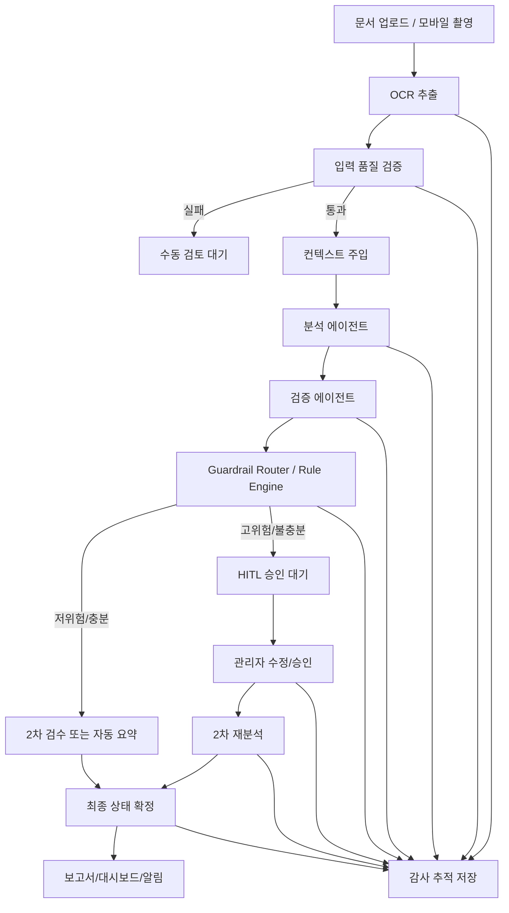
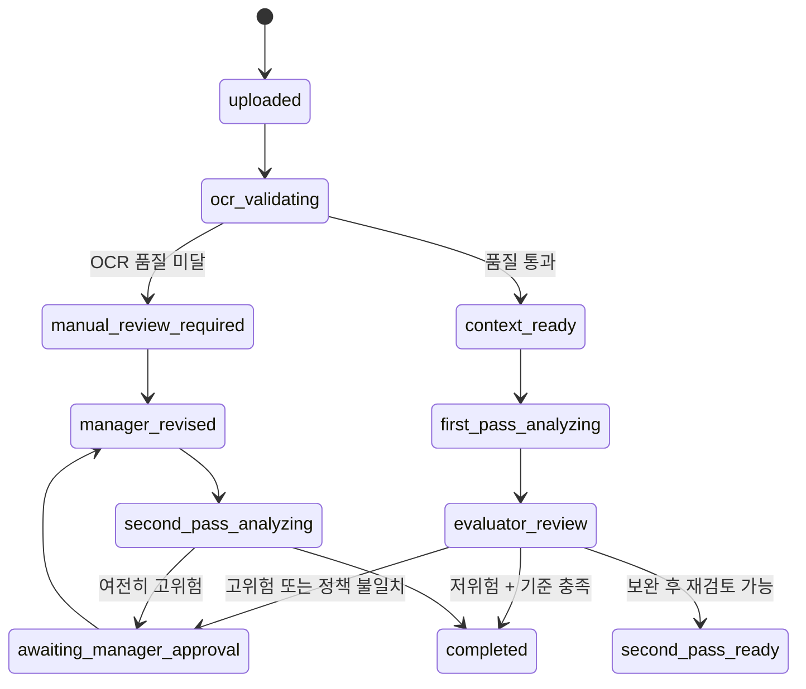

# PSI 하네스 엔지니어링 아키텍처 및 구현 전략

기준일: 2026-04-10  
대상 시스템: PSI (Predictive Safety Intelligence)  
적용 범위: 건설 안전 최적화 AI 시스템 전반  
권장 우선순위: Guardrails 우선 도입 → 상태 머신/오케스트레이션 확장 → 멀티모달/감사 추적 고도화

---

## 1. 문서 목적

이 문서는 PSI를 단순한 "AI 분석 호출기"가 아니라, 안전 임계 환경에서 인간의 책임과 법적 통제를 보장하는 "하네스 기반 운영 시스템"으로 전환하기 위한 아키텍처 원칙과 실행 전략을 정리한다.

핵심 목표는 다음 4가지다.

1. LLM의 확률적 판단을 결정론적 가드레일로 통제한다.
2. 인간 승인 없이 고위험 판단이 확정되지 않도록 상태 머신을 강제한다.
3. 프론트엔드의 공감형 코칭 UX와 백엔드의 엄격한 규정 집행 로직을 분리한다.
4. 중대재해처벌법 대응이 가능한 감사 추적 체계를 기본 기능으로 내장한다.

---

## 2. PSI에 필요한 AI 통제 철학

### 2.1 기본 입장

건설 현장은 일반적인 생산성 보조형 AI 도메인이 아니다.  
PSI에서 AI는 "최종 판정자"가 아니라 "근거를 제안하는 분석 부품"이어야 한다.

따라서 PSI는 다음 철학을 채택해야 한다.

- AI는 위험 신호를 해석하고 제안한다.
- 규정 준수 여부는 룰 엔진이 확정한다.
- 고위험 상태 해제는 권한 있는 인간이 승인한다.
- 모든 상태 전이는 로그와 근거를 남긴다.

### 2.2 운영 원칙

- **LLM First**가 아니라 **Harness First**
- **생성 결과 우선**이 아니라 **정책 검증 우선**
- **대화형 친절함**과 **법적 통제 로직**의 분리
- **한 번의 추론**이 아니라 **검증 가능한 다단계 워크플로우**

---

## 3. 목표 아키텍처 개요

## 3.1 전체 구조



## 3.2 계층 분리

### 프론트엔드 계층
- 역할별 UX
- 코칭형 카피
- 상태 설명 UI
- 인간 승인 액션 UI
- 감사 로그 열람 UI

### AI 오케스트레이션 계층
- 입력 검증
- 프롬프트 조합
- 상태 머신 제어
- 재시도/타임아웃/복구
- 에이전트 간 라우팅

### 정책 집행 계층
- 규정 기반 룰 엔진
- 임계값 검증
- 고위험 키워드 오버라이드
- 승인 필요 여부 결정

### 데이터/감사 계층
- Supabase 저장
- 이벤트 로그
- 정책 버전 스냅샷
- 승인 서명/타임스탬프

---

## 4. 현재 코드베이스 기준 권장 역할 분리

현재 PSI는 다음 기술 기반 위에 있다.

- 프론트엔드: React 19 + Vite + TypeScript
- API: Vercel Serverless 함수
- DB/스토리지: Supabase
- LLM: Gemini 계열 사용 흔적 존재
- 분석 UI: 대시보드/보고서/모달/차트 중심

이를 기준으로 역할을 다음처럼 분리하는 것이 적합하다.

| 계층 | 책임 | 현재 연관 영역 | 향후 확장 방향 |
|---|---|---|---|
| UI/UX | 공감형 코칭, 역할별 설명, 승인 흐름 노출 | `pages/*`, `components/shared/*`, `components/modals/*` | Role-aware 승인 패널, 감사 로그 패널 |
| API Gateway | 인증, 입력 정규화, 액션 라우팅 | `api/gateway.ts` | 하네스 진입점으로 확장 |
| Guardrails | 입력/출력 검증, 정책 위반 차단 | 신규 계층 필요 | `api/harness/*` 또는 `lib/server/harness/*` |
| Workflow | 상태 전이, 재분석, 승인 잠금 | 일부 상태 개념 존재 | LangGraph/Temporal 기반 워크플로우 |
| Audit | 스냅샷, 정책 버전, 승인 기록 | Supabase migrations 활용 가능 | `ai_audit_logs`, `workflow_events`, `human_approvals` |

---

## 5. 핵심 설계 원칙

## 5.1 관심사의 분리

### 프론트엔드는 "내 편인 코치"
프론트엔드는 다음을 담당한다.

- 위험 상태를 위협적으로 전달하지 않고 행동 중심으로 설명
- 근로자/관리자/경영진별 메시지 차등화
- 왜 이 상태가 나왔는지 설명 가능한 카드 구조 제공
- 수동 승인/보완 요청/재분석 요청 UI 제공

### 백엔드는 "깐깐한 규정 집행기"
백엔드는 다음을 담당한다.

- 위험 키워드/수치/규정 위반 여부를 엄격히 검증
- LLM 출력 JSON 스키마 강제
- 거짓 안전(False Negative) 방지 오버라이드
- 인간 승인 없이는 특정 상태 전이 금지

## 5.2 결정론 우선

다음 판단은 LLM에게 맡기지 않는다.

- 필수 키워드 누락 여부
- 법정 임계 수치 위반 여부
- OCR 신뢰도 기준 미달 여부
- 고위험 작업군의 자동 승인 여부
- 승인 권한/서명 유효성

## 5.3 고위험 작업 우선 통제

다음 작업군은 무조건 하드 가드레일 대상이어야 한다.

- 거푸집 동바리
- 시스템 비계 / 이동식 비계
- 고소작업
- 개구부 작업
- 타워크레인 인상/해체/반경 작업
- 중량물 인양
- 굴착/흙막이
- 데크플레이트 / 갱폼 / 초고층 가설 구조물

---

## 6. 하네스 엔지니어링 세부 아키텍처

## 6.1 입력 전 검증 레이어

LLM 호출 전에 반드시 다음을 검증한다.

### 문서 품질 검증
- OCR 추출 길이 최소 기준
- 특수문자 비율 과다 여부
- 숫자/키워드 밀도 부족 여부
- 이미지 해상도 기준
- OCR confidence 평균/최저치

### 현장 메타데이터 검증
- 현장 ID
- 공종
- 작업 일시
- 작업 위치
- 담당 반장/팀장
- 승인 필요 플래그

### 실패 시 강제 상태
- `NEEDS_OCR_REVIEW`
- `INSUFFICIENT_CONTEXT`
- `MANUAL_REVIEW_REQUIRED`

권장 구현 위치:
- `lib/server/harness/inputValidators.ts`
- `lib/server/harness/contextAssembler.ts`

## 6.2 컨텍스트 주입 레이어

프롬프트는 단일 문자열이 아니라, 조립 가능한 구조체로 관리한다.

### 레이어 1. 시스템 지시어
- 산업안전보건법 준수
- 지정 JSON 외 출력 금지
- 의료/법률 최종 판단 금지
- 근거 없는 추론 금지

### 레이어 2. 정적 지식
- KOSHA 매뉴얼 요약
- 사내 안전 기준
- 고위험 작업 체크리스트
- 과거 사고/아차사고 패턴

### 레이어 3. 동적 컨텍스트
- 기상 정보
- 풍속/강우량
- 당일 작업 계획
- IoT/센서 이벤트
- 현장 최근 경고 이력

권장 구현 위치:
- `lib/server/harness/promptLayers.ts`
- `lib/server/harness/contextProviders/*`

## 6.3 분석/검증 분리

### Analyzer Agent
입력:
- OCR 텍스트
- 현장 메타데이터
- 동적 컨텍스트

출력:
- 구조화된 위험 항목
- 6대 지표 점수
- 근거 텍스트 스팬
- 권장 조치 초안

### Evaluator Agent
입력:
- Analyzer 결과
- 정책 기준
- 원문 텍스트

출력:
- 규정 부합 여부
- 근거 충실도 점수
- 허위/누락 가능성 플래그
- 재분석 필요 여부

### Guardrail Router
입력:
- Analyzer 결과
- Evaluator 결과
- Rule Engine 결과

출력:
- 최종 상태
- 인간 승인 필요 여부
- 강제 오버라이드 로그

권장 구현 위치:
- `lib/server/harness/agents/analyzer.ts`
- `lib/server/harness/agents/evaluator.ts`
- `lib/server/harness/router.ts`

## 6.4 출력 후 결정론적 오버라이드

다음은 룰 엔진이 강제로 뒤집을 수 있어야 한다.

- `추락`, `개구부`, `비계`, `안전대` 조합 누락
- `동바리`, `장선`, `멍에`, `간격` 수치 위반
- `타워크레인` + 작업 반경 내 인원 통제 누락
- `이동식 비계` + 난간/아웃트리거 누락
- `고소작업` + 구명줄/안전대/작업발판 누락

권장 상태 예시:
- `SAFE_TO_PROCEED`
- `SUPPLEMENTARY_REVIEW`
- `IMMEDIATE_ATTENTION`
- `CRITICAL_STOP`
- `AWAITING_MANAGER_APPROVAL`
- `APPROVED_WITH_EVIDENCE`

---

## 7. 상태 머신 설계

## 7.1 기본 상태 흐름



## 7.2 상태 정의

| 상태 | 의미 | 자동 전이 가능 여부 | 인간 승인 필요 |
|---|---|---|---|
| `uploaded` | 문서 업로드 완료 | 예 | 아니오 |
| `ocr_validating` | OCR/입력 품질 검사 중 | 예 | 아니오 |
| `manual_review_required` | OCR 품질 미달 | 아니오 | 예 |
| `context_ready` | 분석 가능 상태 | 예 | 아니오 |
| `first_pass_analyzing` | 1차 AI 분석 | 예 | 아니오 |
| `evaluator_review` | 검증 에이전트 교차 검증 | 예 | 아니오 |
| `awaiting_manager_approval` | 고위험/불충분 결과 잠금 | 아니오 | 예 |
| `manager_revised` | 관리자 수정/보완 완료 | 예 | 예 |
| `second_pass_analyzing` | 2차 재분석 | 예 | 아니오 |
| `completed` | 최종 확정 | 제한적 | 경우에 따라 예 |

## 7.3 현재 PSI와의 연결

기존의 `secondPassStatus` 개념은 다음처럼 확장하는 것이 적합하다.

- UI 표현용 `secondPassStatus`
- 워크플로우 제어용 `workflowState`
- 정책 집행용 `riskDecision`
- 감사 추적용 `approvalState`

즉, 하나의 상태 필드에 모든 책임을 몰아넣지 않는다.

---

## 8. 프레임워크 권장안

## 8.1 Guardrails

### 단기 권장
- **Guardrails AI**: JSON 구조화, 수치/스키마 검증, 빠른 도입
- **정규식 + 수제 Rule Engine**: 한국 건설 키워드/법정 수치 우선 대응

### 중기 권장
- **NVIDIA NeMo Guardrails**: 대화형 코칭 UI, 주제 이탈 방지, prompt injection 방어

### PSI 권장 조합
1. 출력 구조화/스키마 강제: Guardrails AI
2. 정책 위반 오버라이드: 내부 Rule Engine
3. 대화형 가드: NeMo Guardrails

## 8.2 Workflow

### 권장 조합
- **LangGraph**: 에이전트 내부 상태 머신
- **Temporal**: 장기 실행, 재시도, 내구성, 이벤트 소싱

### 이유
- 모바일/현장 환경의 네트워크 불안정 대응
- API 타임아웃 이후 재개 가능
- 승인 대기 상태 장기 보관 가능
- 워크플로우 복구 및 감사 추적에 유리

## 8.3 데이터 저장

현재 Supabase 기반을 유지하되 다음 테이블을 추가 권장한다.

- `ai_workflow_runs`
- `ai_workflow_events`
- `ai_guardrail_overrides`
- `ai_context_snapshots`
- `ai_human_approvals`
- `ai_policy_versions`
- `ai_prompt_versions`

---

## 9. 데이터 모델 권장안

## 9.1 `ai_workflow_runs`
- `id`
- `source_record_id`
- `site_id`
- `job_type`
- `workflow_state`
- `risk_decision`
- `approval_state`
- `created_at`
- `updated_at`

## 9.2 `ai_guardrail_overrides`
- `id`
- `workflow_run_id`
- `rule_code`
- `rule_version`
- `trigger_type`
- `trigger_payload_json`
- `original_ai_decision`
- `overridden_decision`
- `created_at`

## 9.3 `ai_human_approvals`
- `id`
- `workflow_run_id`
- `approver_worker_id`
- `approver_role`
- `approval_action`
- `approval_comment`
- `signature_url`
- `approved_at`

## 9.4 `ai_context_snapshots`
- `id`
- `workflow_run_id`
- `weather_json`
- `schedule_json`
- `iot_events_json`
- `prompt_version`
- `policy_version`
- `ocr_confidence_json`
- `created_at`

---

## 10. 한국 건설업 특화 규정 맵핑 전략

## 10.1 트리거 맵 설계

`rule_code` 중심으로 설계한다.

예시:
- `FALL_OPENING_NO_GUARD`
- `SCAFFOLD_NO_HARNESS`
- `SHORING_INTERVAL_EXCEEDED`
- `CRANE_RADIUS_ACCESS_CONTROL_MISSING`
- `LADDER_UNSAFE_USAGE`
- `WIND_RISK_HIGH_FOR_LIFTING`

## 10.2 룰 구성 방식

각 룰은 최소 다음 정보를 가진다.

- 적용 공종
- 필수 키워드
- 금지 조합
- 수치 임계값
- 증빙 요구 여부
- 자동 차단 여부
- 관리자 승인 필요 여부

## 10.3 예시

### 동바리 관련
- 키워드: `동바리`, `장선`, `멍에`, `수평연결재`
- 수치: 높이, 간격, 하중
- 누락 시 상태: `IMMEDIATE_ATTENTION` 또는 `CRITICAL_STOP`

### 고소작업 관련
- 키워드: `안전대`, `구명줄`, `안전난간`, `작업발판`
- 누락 시 상태: `CRITICAL_STOP`

### 타워크레인 관련
- 키워드: `작업반경`, `통제`, `신호수`, `유도자`
- 누락 시 상태: `IMMEDIATE_ATTENTION`

---

## 11. 멀티모달 환각 억제 전략

## 11.1 왜 필요한가

OCR 오독은 PSI의 가장 위험한 실패 지점 중 하나다.  
텍스트만으로 판단하면 "추락"이 "취락"으로 잘못 읽힌 경우 치명적 누락이 발생한다.

## 11.2 권장 전략

1. OCR 텍스트와 원본 이미지를 함께 보존
2. OCR confidence 하드 임계값 적용
3. 저신뢰 구간은 하이라이트하여 관리자 검토 유도
4. 가능 시 Vision-Language Model 재검증 경로 추가
5. 체크박스/표/서명 영역은 별도 파서로 분리

## 11.3 상태 연동

- OCR confidence 평균 < 85% → `MANUAL_REVIEW_REQUIRED`
- 핵심 키워드 포함 문장의 confidence 낮음 → `SUPPLEMENTARY_REVIEW`
- 이미지와 텍스트 불일치 → `AWAITING_MANAGER_APPROVAL`

---

## 12. 프론트엔드 구현 전략

## 12.1 현재 PSI 브랜드 원칙과의 정합성

현재 프로젝트의 브랜드 원칙은 이미 다음을 강조하고 있다.

- 평가보다 해석
- 지적보다 보완
- 감시보다 보호
- 지금 상태 → 판단 근거 → 다음 행동

하네스 엔지니어링은 이 원칙을 해치지 않는다.  
오히려 백엔드가 더 엄격해질수록 프론트엔드는 더 설명 가능하고 더 인간적으로 설계될 수 있다.

## 12.2 UI에 추가할 핵심 블록

### 관리자용
- `ApprovalRequiredPanel`
- `GuardrailOverrideLogPanel`
- `WorkflowStateTimeline`
- `EvidenceChecklistPanel`

### 근로자용
- `WhatChangedPanel`
- `WhyThisNeedsAttentionPanel`
- `NextSafeActionChecklist`

### 경영진용
- `RiskEscalationSummary`
- `ApprovalBacklogPanel`
- `SiteComplianceTrendPanel`

## 12.3 현재 코드와의 연결 포인트

다음 화면이 우선 대상이다.

- `pages/Dashboard.tsx`
- `pages/Reports.tsx`
- `pages/WorkerManagement.tsx`
- `pages/FieldSafetyComplianceHub.tsx`
- `components/modals/RecordDetailModal.tsx`

기존 shared 컴포넌트 중 재사용성이 높다.

- `InterpretationCardGrid`
- `StatusEvidenceActionPanel`
- `SummaryMetricGrid`
- `SectionPanelCard`
- `OperationalPreviewCard`
- `NoticeCallout`
- `WhyThisResultPanel`
- `NextActionChecklist`

---

## 13. 백엔드 구현 전략

## 13.1 권장 폴더 구조

```text
lib/
  server/
    harness/
      inputValidators.ts
      outputValidators.ts
      ruleEngine.ts
      policyRegistry.ts
      contextAssembler.ts
      promptLayers.ts
      router.ts
      auditLogger.ts
      workflowTypes.ts
      agents/
        analyzer.ts
        evaluator.ts
      rules/
        fallProtectionRules.ts
        shoringRules.ts
        craneRules.ts
        scaffoldRules.ts
api/
  harness/
    analyze.ts
    approve.ts
    reanalyze.ts
    workflow-status.ts
```

## 13.2 API 전략

### `POST /api/harness/analyze`
- OCR 및 메타데이터 입력
- 입력 검증
- 컨텍스트 조합
- 1차 분석 수행
- 룰 엔진 적용
- 상태 반환

### `POST /api/harness/approve`
- 관리자 승인/반려
- 서명/사유 저장
- 상태 잠금 해제 또는 유지

### `POST /api/harness/reanalyze`
- 수정 후 2차 분석
- 이전 결과와 diff 저장

### `GET /api/harness/workflow-status`
- 상태, 이벤트 로그, 승인 이력 조회

---

## 14. 감사 추적(Audit Trail) 전략

## 14.1 반드시 남겨야 하는 항목

- 입력 원문
- OCR 결과
- OCR confidence
- 사용된 프롬프트 버전
- 사용된 정책 버전
- 주입된 실시간 컨텍스트
- Analyzer 출력
- Evaluator 출력
- Guardrail override 결과
- 인간 승인/반려 이력
- 최종 상태

## 14.2 법무/감사 관점 필수 요건

- 누가 승인했는가
- 무엇 때문에 AI 결과가 뒤집혔는가
- 당시 어떤 규칙 버전이 적용되었는가
- 승인 전후 결과가 어떻게 달라졌는가
- 어떤 근거 문장/이미지가 있었는가

## 14.3 로그 저장 원칙

- 수정 불가 append-only 이벤트 선호
- 주요 이벤트는 해시 또는 서명 고려
- 정책 버전과 프롬프트 버전은 snapshot 저장
- 단순 참조가 아니라 당시 사용본을 보존

---

## 15. 단계별 실행 로드맵

## Phase 1. 빠른 리스크 억제 (2~4주)

목표:
- 치명적 False Negative 즉시 줄이기

실행:
- 한국 건설 고위험 키워드 룰셋 정의
- 입력 품질 검증기 추가
- 출력 JSON 스키마 강제
- Rule Engine으로 오버라이드 상태 부여
- 관리자 승인 필요 상태 추가

성과 지표:
- 고위험 누락률 감소
- OCR 품질 미달 자동 차단 비율 확보
- 수동 검토 케이스 분류 가능

## Phase 2. 상태 머신 정식 도입 (4~8주)

목표:
- 승인 없는 확정 차단
- 2차 재분석 정식 워크플로우화

실행:
- `workflowState`, `riskDecision`, `approvalState` 분리
- 승인/반려/재분석 API 구축
- 워크플로우 이벤트 로그 저장
- 관리자 승인 UI 연결

성과 지표:
- 승인 누락 0건
- 상태 추적 가능율 100%
- 재분석 이력 조회 가능

## Phase 3. 오케스트레이션/복원력 고도화 (6~10주)

목표:
- 장애 복구와 장기 실행 안정성 확보

실행:
- LangGraph 도입
- Temporal 연결
- 재시도/타임아웃/중단 후 재개 설계
- 이벤트 소싱 기반 상태 재구성

성과 지표:
- 실패한 워크플로우 자동 재개
- 장기 승인 대기 상태 안정 관리
- 장애 시 데이터 유실 최소화

## Phase 4. 멀티모달 및 실시간 컨텍스트 고도화 (병행)

목표:
- OCR 오독/문맥 누락 방지

실행:
- 원본 이미지 + 텍스트 교차 검증
- 날씨/작업계획/센서 데이터 주입
- 위험 작업 특화 룰 강화

성과 지표:
- 저품질 문서 오판률 감소
- 컨텍스트 반영형 권고 정확도 향상

---

## 16. 조직 운영 관점 권장 의사결정

## 방향 A. Guardrails 우선 도입
적합한 경우:
- 단기간 리스크 억제가 최우선일 때
- 현재 운영 중인 API 흐름을 크게 깨지 않고 개선할 때

장점:
- 빠른 적용
- 즉시 안전성 향상
- 상대적으로 낮은 비용

## 방향 B. 상태 머신/오케스트레이션 우선 개편
적합한 경우:
- 장기적으로 감사 추적과 승인 체계가 핵심일 때
- 멀티에이전트 확장을 전제로 할 때

장점:
- 구조적 안정성
- 재시도/복구/추적 용이
- 법적 방어력 강화

## PSI 권장 결론

PSI는 다음 순서를 권장한다.

1. **Guardrails + Rule Engine 즉시 도입**
2. **승인 잠금 상태 머신 확장**
3. **LangGraph/Temporal로 장기 실행 워크플로우 이전**
4. **멀티모달 및 실시간 컨텍스트 주입 고도화**

---

## 17. 즉시 실행 가능한 우선 작업

### 1주차
- 고위험 공종 룰 목록 정의
- 상태 enum 정리
- OCR 품질 검증 기준 수립

### 2주차
- `analyze` 하네스 API 초안 구현
- `ruleEngine.ts` 초안 구현
- 결과 오버라이드 로깅 추가

### 3주차
- 관리자 승인 UI 초안 연결
- 감사 로그 테이블 마이그레이션 작성
- `RecordDetailModal` 또는 승인 모달에 승인/반려 흐름 삽입

### 4주차
- 대시보드에 승인 대기/오버라이드 현황 노출
- 보고서에 근거/정책 버전/승인 이력 포함

---

## 18. 최종 결론

PSI에서 하네스 엔지니어링은 선택 기능이 아니라 안전성과 법적 책임성을 확보하기 위한 필수 운영 인프라다.

정리하면 다음과 같다.

- 프론트엔드는 계속 "깐깐하지만 내 편인 코치"여야 한다.
- 백엔드는 더 엄격한 결정론적 통제망으로 바뀌어야 한다.
- AI는 분석을 제안할 뿐, 최종 확정 권한을 독점해서는 안 된다.
- 고위험 작업과 저품질 입력은 반드시 하드 가드레일 아래에 둬야 한다.
- 모든 상태 전이와 승인 기록은 감사 추적 가능한 형태로 남겨야 한다.

이 구조가 갖춰질 때 PSI는 단순한 생성형 UI 제품이 아니라, 건설 안전 현장에서 실제로 신뢰받는 프로덕션급 통제 시스템으로 진화할 수 있다.
