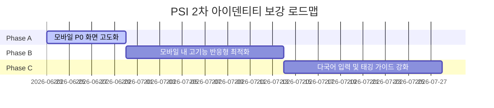

# 🎯 PSI 브랜드 아이덴티티 보강 2차 로드맵 (2026-06-23)

본 문서는 PSI의 핵심 페르소나인 **"깐깐하지만 내 편인 현장 안전 코치"** 및 **"현장의 신호를 읽고 사람을 보호하는 파트너"**의 가치를 제품에 투영하기 위한 2차 기능 보수보강 로드맵입니다.

---

## 🎨 핵심 아이덴티티 3원칙
1. **행동 전환 중심 (Action-Oriented)**
   - 단순한 위험 수치(안전 점수)를 경고하는 것에 그치지 않고, "지금 즉시 현장에서 취해야 할 한 가지 구체적 행동(CTA)"을 제시합니다.
2. **비난 방지 및 심리적 안전감 (Psychological Safety)**
   - 근로자나 관리자에게 "불합격", "불량 작성" 같은 낙인효과 단어를 배제하고, "설명 보완 권장", "확인 필요" 등의 보호적 피드백을 제공합니다.
3. **모바일 기능 동등성 보장 (Feature Parity & Responsive UI)**
   - 모바일 화면에서도 PC에서 사용 가능한 복잡한 데이터 조회, 관리 설정, 엑셀/PDF 제어, 통계 테이블 등의 고급 기능을 동일하게 사용할 수 있도록 유지하며, 320px 모바일 화면부터 태블릿까지 부드럽게 스크롤 및 터치 조작이 가능하도록 반응형 레이아웃을 고도화합니다.

---

## 📅 단계별 실행 계획 (Phased Roadmap)

### 📍 Phase A: 모바일 P0 (2/4/8번) 액션 고도화 (1주)
* **목표**: 모바일 환경에서 실무자가 위험을 인지한 후 즉각적으로 행동할 수 있도록 UI 흐름을 단축합니다.
* **주요 기능**:
  1. **2번 (경보 알림)**: 단순 텍스트 경보 목록에서 벗어나, 상단에 **"즉시 안전 교육 배포"** 또는 **"서명 확인 요청"**과 같은 **고정 CTA 버튼**을 도입하여 현장 개입 속도를 단축합니다.
  2. **4번 (위험 인지 진단)**: 복잡한 안전 통계 점수판 대신 **"오늘의 안전 진행율"**과 **"이해도가 보완되어야 할 근로자 카드"**를 상단에 직관적인 카드 UI로 전면 배치합니다.
  3. **8번 (개입 추천)**: 에이전트의 개입 추천 조치사항 아래에 **"조치 완료"** 버튼을 도입하고, 완료 시 실시간으로 이력을 데이터베이스에 업데이트하여 환류(Closed-Loop) 구조를 형성합니다.

### 📍 Phase B: 모바일 내 PC 동등 기능 반응형 UI 고도화 (2주)
* **목표**: 모바일 기기에서도 PC 수준의 복잡한 통계, 그리드, 관리 기능을 축소 없이 온전히 사용할 수 있도록 UI 사용성을 강화합니다.
* **주요 기능**:
  1. **반응형 테이블/그리드 스크롤**: 컬럼이 많은 데이터 그리드와 통계 표에 대해 모바일 뷰포트에서 가로 스크롤 및 컬럼 고정(Sticky Column)을 지원하여 데이터 누락 없이 볼 수 있게 구성합니다.
  2. **적응형 아코디언 및 카드 뷰**: 모바일 세로 화면에서는 복잡한 표 레이아웃 대신 확장/축소가 가능한 **카드 형태(Accordion Card)**로 자동 전환하여 터치 환경에서의 정보 탐색력을 높입니다.
  3. **터치 타겟 및 모달 최적화**: 팝업창(Modal)과 버튼 크기를 모바일 손가락 터치 규격(최소 44px 이상)에 맞춰 재조정하고, 모바일 파일 탐색기를 통한 엑셀/PDF 업로드/다운로드 동선을 최적화합니다.

### 📍 Phase C: 다국어 입력 및 태깅 가이드 강화 (2주)
* **목표**: 외국인 근로자 대상 수기 서명 및 태깅 과정의 마찰을 제거하여 실증 데이터의 순도를 높입니다.
* **주요 기능**:
  1. **5번 (현장 컨텍스트 입력) & 9번 (수기 입력 검증)**: 수기 답변을 번역 및 검증하는 UI에서 각 국가별 언어 가이드(예: 크메르어, 우즈베크어 등)를 입력 힌트 툴팁으로 실시간 렌더링합니다.
  2. **다국어 음성 안내 연동**: 모국어 안내 음성이 모바일 기기 스피커로 한글 번역 텍스트와 동시에 올바르게 흘러나오도록 사운드 플레이어 제어를 반응형으로 최적화합니다.
