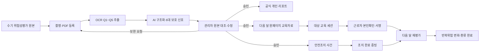

# PSI 제품 가치 및 디자인 통합 청사진

- 작성일: 2026-08-21
- 문서 상태: 구현 기준본 — 구현 완료와 출시 전 잔여 조건을 구분해 관리
- 적용 대상: NEW-PSI 웹 프로그램, 관리자·근로자 화면, 보고서·교육자료, API·데이터·운영 정책
- 검증된 기본 운영 단위: 월간 위험성평가 환류
- 문서 목적: 기능을 더 많이 보이게 만드는 것이 아니라, PSI가 지켜야 할 가치와 출시 기준을 한 문서에서 판단할 수 있게 한다.

> 이 문서는 법률 자문, 개인정보 영향평가, 정보보호 인증을 대신하지 않는다. 보존기간과 법정 기록 범위는 고객 계약, 회사 정책, 관할 법률 검토 후 확정한다.

---

## 1. 한눈에 보는 결론

### 1.1 제품 정의

> PSI는 근로자가 직접 쓴 위험성평가 기록지를 OCR·AI로 구조화하고, 관리자가 원본과 결과를 확인한 뒤, 다음 달 원페이지 교육자료·안전조치·반복위험 추적으로 되돌리는 현장 안전 운영 시스템이다.

### 1.2 브랜드 약속

> 쓴 위험을 놓치지 않고, 확인된 행동으로 되돌린다.

### 1.3 핵심 차별점

PSI의 차별점은 OCR 정확도 하나가 아니다. 다음 다섯 가지가 한 근거 체계로 이어지는 데 있다.

1. 익숙한 수기 작성 흐름을 유지한다.
2. Q1~Q5와 6대 보호 신호로 기록을 구조화한다.
3. AI 결과를 관리자가 원본과 대조하고 수정·승인한다.
4. 검증된 결과를 공식 리포트와 원페이지 교육자료로 만든다.
5. 다음 달 같은 위험이 줄었는지 확인한다.

### 1.4 현재 제품 경계

| 구분 | 현재 원칙 | 대외 표현 |
|---|---|---|
| 월간 환류 | 현장 문서와 코드에서 가장 오래 검증된 기본값 | 핵심 상품 |
| 일일·주간·격주·맞춤 주기 | 엔진과 설정은 지원하지만 동등 수준의 현장 검증은 부족 | 고급 설정·확장 기능 |
| 다국어 번역본 | 외국인 근로자 지원 수단 | 보조 전달 수단 |
| QR·음성 | 기본 실무 메뉴에서 분리된 파일럿 | 파일럿 |
| 예측·고급 분석 | 운영 데이터가 충분할 때 의미가 생김 | 선택형 고급 분석 |
| 다현장·다테넌트 상용 SaaS | RBAC·테넌트 격리·운영 증빙이 미완료 | 출시 준비 중 |

### 1.5 가장 먼저 지킬 결정

- 기본 화면에서는 점수보다 상태, 근거, 다음 행동을 먼저 보여준다.
- AI는 제안자이고 관리자는 최종 판단자다.
- 근로자에게 개인 점수·순위·낙인 표현을 공개하지 않는다.
- 월간 환류를 검증된 기본값으로 유지한다.
- 다른 운영 주기는 설정에서만 선택하고, 검증 전에는 핵심 상품 주장으로 사용하지 않는다.
- QR·음성·외부 AI는 핵심 흐름이 아니라 명확히 표시된 보조 경로다.
- 기존 기본 대시보드는 사용자 승인 없이 다시 대수술하지 않는다.
- 상용 환경에서는 브라우저 API 키와 무통제 개인정보 외부 전송을 허용하지 않는다.

---

## 2. 가치 체계

### 2.1 사용자와 제품이 공유하는 가치

1. **사람 보호**
   - 판단의 목적은 사람을 평가하는 것이 아니라 사고 가능성을 줄이는 것이다.
2. **현장 사실 우선**
   - 원본 기록, 현장 맥락, 관리자 확인이 모델 추론보다 우선한다.
3. **설명 가능한 정확성**
   - 결과마다 무엇을 읽었고, 왜 그렇게 판단했으며, 누가 수정했는지 남긴다.
4. **행동으로 닫히는 흐름**
   - 분석은 조치·교육·재확인으로 이어질 때만 가치가 완성된다.
5. **쉬운 겉면과 정밀한 내부**
   - 현장 사용자는 적은 버튼으로 처리하고, 감사자는 필요한 근거를 끝까지 추적한다.
6. **심리적 안전감**
   - 사람을 낙인찍지 않고 보완해야 할 위험 신호와 행동을 말한다.
7. **운영 가능한 신뢰**
   - 보안, 권한, 복구, 감사, 비용이 실제 현장에서 지속 가능해야 한다.

### 2.2 사용자가 중요하게 여긴 가치

현재 문서와 변경 이력에서 다음 요구를 높은 확률로 확인할 수 있다.

- 종이 위험성평가를 버리지 않고 현장 습관을 존중한다.
- 5문항·6지표·관리자 검증·다음 달 교육·월별 추적을 하나의 제품으로 묶는다.
- 기능 부족보다 정체성 혼선과 과장된 설명을 먼저 해결한다.
- 대시보드 등 이미 만족한 화면은 안정적으로 보존한다.
- 모든 기능을 없애지는 않되, 기본 화면에는 필요한 것만 보이게 한다.
- 공모전·바이어 앞에서 2분 안에 가치가 증명되도록 한다.
- 디자인은 개발 도구가 아니라 상업화된 산업 안전 제품처럼 보여야 한다.
- 다국어·QR은 현장 문제를 해결할 때만 쓰며, 핵심인 것처럼 과장하지 않는다.

### 2.3 이 청사진에서 추가로 제안하는 제품 가치

1. **기록의 수보다 환류 완료율을 본다.**
2. **점수의 높고 낮음보다 반복위험이 줄었는지를 본다.**
3. **AI 자동화율보다 관리자 수정이 안전하게 전파되는지를 본다.**
4. **기능 수보다 첫 행동까지 걸리는 시간을 줄인다.**
5. **무결성 해시는 진본성으로 과장하지 않고 정확한 의미만 표시한다.**
6. **상용 가능 여부를 기능 시연과 분리해 정직하게 표시한다.**

### 2.4 가치 우선순위

충돌이 생기면 아래 순서로 결정한다.

1. 사람의 생명·안전과 개인정보 보호
2. 현장 사실과 관리자 최종 판단
3. 데이터 무결성·권한 격리·감사 가능성
4. 행동 완료와 반복위험 감소
5. 사용성·접근성·모바일 조작성
6. 운영 비용·성능·확장성
7. 시각적 인상과 시연 효과

예쁜 화면이나 빠른 자동화가 상위 원칙을 침해하면 채택하지 않는다.

### 2.5 반가치: PSI가 되지 말아야 할 것

- OCR 기술 시연 앱
- 근로자 감시·순위·징계 도구
- AI 결과를 사실처럼 자동 확정하는 시스템
- 위험 점수만 크게 보여주는 대시보드
- 모든 기능과 버튼을 한 화면에 펼쳐 놓는 제품
- QR·다국어·음성을 핵심 가치로 과장하는 제품
- 개발자만 이해하는 용어를 실무자에게 노출하는 제품
- 내부 일치 확인값을 전자서명이나 법적 진본성으로 오인시키는 제품
- 브라우저 저장소에 비밀키와 개인정보를 장기 보관하는 제품
- 현장·테넌트 경계가 불명확한 다현장 SaaS
- 실패를 숨기거나 정상 통계에 섞는 시스템
- 승인된 원문과 번역·리포트가 서로 다른 버전으로 남는 시스템
- 검증되지 않은 운영 주기를 검증된 성과처럼 판매하는 제품

---

## 3. 이해관계자와 해야 할 일

| 이해관계자 | 해야 할 일 | 주요 불안 | 성공 기준 |
|---|---|---|---|
| 근로자 | 익숙한 방식으로 위험을 적고 이해한 교육을 확인한다. | 감시, 불이익, 어려운 언어, 서명 오용 | 짧고 명확한 안내, 본인 언어, 개인 점수 비공개 |
| 현장 안전관리자 | 기록을 빠르게 검토하고 위험·조치·교육을 연결한다. | 기록 누락, AI 오판, 버튼 과다, 시간 부족 | 확인 대기 우선순위와 다음 행동이 즉시 보임 |
| 검토·승인권자 | 원본과 수정 이력을 보고 공식 결과를 확정한다. | 근거 부족, 승인 책임 불명확 | 승인 근거·버전·수정 전후가 남음 |
| 교육 담당자 | 검증된 위험을 다음 달 교육자료로 만든다. | 오래된 번역, 근거 없는 사례, 출력 오류 | 승인 원문과 같은 버전의 한 장 자료 |
| 본사 안전조직 | 현장·공종·월별 반복위험과 조치 효과를 본다. | 현장 간 지표 불일치, 개인 노출 | 공통 지표와 익명 집계, 비교 가능한 추세 |
| 경영진·구매자 | 사고예방 효과와 운영 준비도를 판단한다. | 과장된 AI 주장, 비용·보안 불확실성 | 환류 완료율, 반복위험 변화, 출시 준비 증빙 |
| 감사자 | 원본부터 승인·교육·재평가까지 추적한다. | 변경 흔적 누락, 해시 의미 혼선 | 변경 불가 감사 로그와 재현 가능한 패키지 |
| 테넌트 관리자 | 현장·사용자·역할·보존정책을 관리한다. | 권한 과다, 현장 간 데이터 노출 | 최소 권한과 현장·테넌트 격리 |
| 플랫폼 운영·보안 담당 | 배포, 모니터링, 장애·복구를 책임진다. | 비밀키 노출, 장애 탐지 지연, 복구 실패 | SLO, 알림, 복구훈련, 감사 가능한 운영 |

### 3.1 역할별 기본 화면 원칙

- 근로자: 교육 내용, 이해 확인, 본인 제출만 표시한다.
- 현장 관리자: 오늘 확인할 기록, 보호 판단, 조치, 교육 환류를 표시한다.
- 승인권자: 원본 대조, 변경 전후, 승인 근거를 표시한다.
- 본사·경영진: 익명 집계, 추세, 완료율, 반복위험을 표시한다.
- 감사·개발자: 해시, 모델·프롬프트·정책 버전, 실패 코드, 원시 내보내기를 표시한다.

---

## 4. 제품 경계와 주장 정책

### 4.1 주장 등급

| 등급 | 의미 | 표시 규칙 |
|---|---|---|
| 구현됨 | 코드 경로가 존재한다. | 구현 사실만 말한다. |
| 자동 검증됨 | 테스트나 정적 계약이 통과한다. | 테스트 범위와 한계를 함께 적는다. |
| 현장 검증됨 | 실제 사용자·실데이터로 목표 기준을 통과했다. | 표본 수·현장·기간을 제시한다. |
| 파일럿 | 제한된 조건에서 시험 중이다. | 핵심 상품처럼 표시하지 않는다. |
| 출시 준비 중 | 보안·권한·운영 조건이 남았다. | 상용 완료로 표현하지 않는다. |

### 4.2 허용 문장

- “관리자가 원본과 분석 결과를 대조하고 수정할 수 있습니다.”
- “월간 기록을 다음 달 원페이지 교육자료와 반복위험 추적으로 연결합니다.”
- “QR·음성은 확정 교육자료의 보조 전달 채널로 시험 운영합니다.”

### 4.3 금지 또는 근거가 필요한 문장

- “AI가 사고를 예방합니다.”
- “모든 현장에서 정확도가 95%입니다.”
- “해시로 법적 진본성이 보장됩니다.”
- “완전한 다현장 SaaS입니다.”
- “교육 대상자 외에는 제출할 수 없습니다.” — 서버 강제 검증 완료 전 금지
- “개인정보가 외부 AI로 전송되지 않습니다.” — 브라우저 Gemini 경로 제거 전 금지

---

## 5. 보호 폐루프 아키텍처

### 5.1 기준 흐름



### 5.2 핵심 식별자

| 식별자 | 역할 |
|---|---|
| `tenant_id` | 고객 조직 경계 |
| `site_id` | 현장 경계 |
| `cycle_id` | 월간 기본 운영 주기와 정책 스냅샷 |
| `record_id` | 원본 위험성평가 기록 |
| `worker_id` | 동일 근로자 연결용 안정 식별자 |
| `case_id` | 위험 발견부터 조치·보고·교육·재평가까지 묶는 보호 사건 |
| `report_id` | 승인된 리포트 버전 |
| `education_package_id` | 원페이지 교육자료 버전 |
| `session_id` | 실제 교육 배포·대상·제출 단위 |
| `evidence_id` | 증빙 객체와 감사 로그 연결 |

이름, 전화번호, 팀명 같은 표시값을 관계 키로 사용하지 않는다.

### 5.3 상태 모델

```text
UPLOADED
→ ANALYZED
→ REVIEW_REQUIRED
→ APPROVED 또는 SUPPLEMENT_REQUESTED
→ ACTION_IN_PROGRESS
→ REPORT_READY
→ EDUCATION_PUBLISHED
→ ACKNOWLEDGED
→ REASSESSED
→ CLOSED
```

규칙:

- `SUPPLEMENT_REQUESTED`는 재촬영·재작성 후 다시 `REVIEW_REQUIRED`로 돌아간다.
- 관리자 승인 없이 공식 리포트와 교육 배포를 확정하지 않는다.
- 관리자 수정 시 번역, 점수, 리포트, 교육자료를 구버전으로 표시하고 재생성한다.
- 단계 건너뛰기는 권한과 사유가 있는 예외 처리만 허용하며 감사 로그를 남긴다.
- 관리자 대리 입력·대리 서명은 근로자 본인확인과 별도 상태로 기록한다.

### 5.4 월간 기본과 고급 주기

- 기본 `cycle_id`는 달력 월과 현장 기준일을 사용한다.
- 월간 화면·보고서·KPI를 우선 검증한다.
- 일일·주간·격주·맞춤 주기는 고급 설정에서만 활성화한다.
- 고급 주기는 월간과 다른 기준일, 비교 분모, 교육 마감일을 별도 정책 버전으로 저장한다.
- 고급 주기별 현장 검증을 통과하기 전에는 월간과 같은 수준의 상품 성과를 주장하지 않는다.

---

## 6. 정보구조와 화면 청사진

### 6.1 관리자 기본 정보구조

```text
홈
├─ 오늘의 우선 확인
├─ 기한 임박 조치
└─ 환류 완료율

기록·검토
├─ 기록지 촬영·등록
├─ 분석 대기/실패
├─ 관리자 보호 판단
└─ 승인·보완 이력

안전조치
├─ 보호 사건
├─ 담당자·기한·증빙
└─ 완료/기한초과

교육·추적
├─ 원페이지 교육자료
├─ 개인 보호 리포트
├─ 대상 교육 세션
└─ 월간 계도·추적자료

더보기
├─ 근로자·공종 기준정보
├─ 고급 분석
├─ 감사·내보내기
└─ 시스템 설정
```

### 6.2 모바일 하단 내비게이션

| 순서 | 권장 라벨 | 기본 행동 |
|---|---|---|
| 1 | 홈 | 오늘 우선순위 확인 |
| 2 | 기록 | 촬영·등록·분석 |
| 3 | 확인·조치 | 보호 판단과 현장조치 |
| 4 | 교육·추적 | 원페이지·리포트·월간 변화 |
| 5 | 더보기 | 기준정보·설정·고급 기능 |

`계도`와 `교육자료`를 서로 다른 최상위 탭으로 중복시키지 않는다.

### 6.3 홈 화면

필수 구성:

1. 오늘 확인 필요 N건
2. 즉시 보호 N건
3. 기한 초과 조치 N건
4. 이번 달 환류 완료율
5. 가장 중요한 다음 행동 1개
6. 최근 반복위험 변화

금지:

- 빈 상태에서 0건 카드를 반복 표시
- 개인 순위와 최우수/최하위 낙인
- 첫 화면에서 설정·증빙·개발자 도구 노출

### 6.4 기록지 촬영·분석 화면

빈 상태:

- 제목: `첫 위험성평가 기록지를 등록하세요`
- 설명: `사진이나 PDF를 넣으면 확인이 필요한 부분부터 정리합니다.`
- 기본 버튼: `기록지 촬영·분석`

분석 후:

- `관리자 확인 필요 N건`을 첫 상태로 표시
- 기록당 기본 행동은 `보호 판단 열기` 하나
- 문제가 있을 때만 `원본 재판독` 표시
- 삭제, 전체 백업, 증빙 저장은 더보기 또는 감사 모드로 이동

파일 등록 요구:

- 지원 형식과 실제 서버 한도를 같은 정책 상수에서 표시한다.
- 현재 브라우저 업로드 한도 20MB와 서버 재분석 한도 8MB가 다르므로 통일 전까지 경고가 필요하다.
- 8MB를 넘는 이미지는 전송 전에 압축하거나, 압축 불가 시 명확히 차단한다.
- 해상도·초점·잘림·반사·밝기와 파일 크기를 한 사전검사 결과로 보여준다.

### 6.5 근로자 보호 판단 화면

기본 순서:

1. 현재 상태
2. 근로자가 적은 핵심 위험
3. 관리자가 확인할 세 가지
4. 오늘 전달할 교육 문장
5. 다음 행동

기본 행동:

- `보완 요청`
- `보호 판단 확정`

상세 근거 안으로 이동할 정보:

- 수치 점수
- OCR 신뢰도
- 무결성 점수
- 증빙 고유값
- 모델·프롬프트·정책 버전
- 세부 루브릭과 가중치

모바일 요구:

- 원본 전체 이미지가 판단 화면보다 먼저 긴 영역을 차지하지 않는다.
- 상단에는 상태와 다음 행동을 먼저 보여주고 원본은 썸네일·전체화면으로 연다.
- 저장·보완·확정 중 현재 가능한 주요 행동 하나를 하단에 고정한다.
- 뒤로가기와 닫기에서 미저장 변경을 보호한다.

### 6.6 안전조치 화면

- 위험 신호에서 `case_id`를 생성하거나 기존 사건에 연결한다.
- 담당자, 완료기한, 조치 유형, 현장 위치, 증빙, 검토자를 저장한다.
- 임시완료와 최종확인을 구분한다.
- 기한 초과 사유와 재기한을 기록한다.
- 삭제 대신 취소·무효화 상태와 사유를 사용한다.

### 6.7 교육 환류 화면

세 결과물을 같은 우선순위로 이해할 수 있게 하되, 작업 순서는 명확히 한다.

1. 원페이지 교육자료
2. 개인 보호 리포트
3. 월간 계도·추적자료

상단 KPI는 언어 수보다 아래 값을 우선한다.

- 승인 완료 기록
- 교육자료 생성 가능 기록
- 관리자 확인 미완료 기록
- 다음 달 추적 대상

QR·음성은 개발자/파일럿 영역에만 둔다.

### 6.8 원페이지 교육자료

기본 빠른 흐름:

1. 대상월·현장·공종 선택
2. 승인된 기록 자동 연결
3. 위험 TOP3와 실천행동 초안 확인
4. 관리자 수정·승인
5. PDF/PPTX 저장

고급 영역:

- 외부 자료 추가
- 재해사례
- 동영상 구성
- 다국어 번역
- QR·음성 파일럿 전달

파일명은 `PSI_위험성평가교육자료_현장_대상월_공종_버전`을 사용한다. 사용자 다운로드 파일명에서 `TBM교육자료`를 제거한다.

### 6.9 개인 보호 리포트

- 근로자 전달본과 관리자 분석본을 분리한다.
- 근로자 전달본은 모국어 안내와 실천행동을 중심으로 한다.
- 관리자 분석본은 원본·수정·승인·지표 근거를 포함한다.
- ZIP, CSV, JSON, manifest는 감사 모드에서만 표시한다.
- 개인 점수는 관리자 분석 보조 정보로만 쓰고 근로자 전달본의 주인공으로 삼지 않는다.

### 6.10 월간 공식 계도·추적 리포트

현재 화면에 부족한 공식 필드를 반드시 추가한다.

| 필드 | 요구사항 |
|---|---|
| 현장명·현장 ID | 출력과 데이터에 모두 포함 |
| 대상월·교육월 | 분석월과 환류월 구분 |
| 문서번호·버전 | 재발행 시 버전 증가 |
| 분석대상·작성 완료율 | 분모와 제외 사유 포함 |
| 주요 위험·상등급 위험 | 근거 건수 포함 |
| 반복위험 | 전월·당월 수치와 방향 |
| 6대 보호 신호 | 산정 문항·표본·신뢰도 포함 |
| 관리자 검토결과 | 승인·수정·제외 건수와 사유 |
| 교육 반영내용 | 실제 교육 문장·자료 ID 연결 |
| 현장 조치내용 | 담당자·기한·증빙·상태 연결 |
| 전월 대비 변화 | 동일 기준 비교 여부 표시 |
| AI 분석일 | 모델·프롬프트·정책 버전 연결 |
| 관리자 승인일·승인자 | 공식 확정 책임자 |
| 수정이력 | 변경 전후·사유·작성자·시각 |

출력 유형:

- 외부·교육용 익명 보고서
- 내부 관리자용 기명 보고서
- 감사용 근거 패키지

### 6.11 기준정보 관리자 화면

`config/psiFormMaster.ts`의 코드 기반 기준은 시작점일 뿐이다. 상용 운영에는 인증된 브라우저 관리자 CRUD가 필요하다.

관리 대상:

- Q1~Q5 질문·안내·예시
- 공종·세부작업
- 위험유형·위험수준
- 안전조치 표준문구
- 언어별 번역과 승인 상태
- 적용 현장·유효기간

필수 동작:

- 목록, 생성, 복제, 수정, 검토요청, 승인·게시, 보관, 롤백
- 초안과 게시본 분리
- 이미 사용된 게시본은 물리 삭제 금지
- 동시 수정 충돌 감지
- 변경 사유 필수
- PDF·모바일·OCR 프롬프트·교육자료 미리보기
- 게시 버전을 모든 분석 결과에 스냅샷으로 연결

현재 상태: 브라우저 기반 서버 영속 CRUD·승인·롤백은 미완료다.

---

## 7. 상세 기능 요구사항

### FR-01 현장·조직 설정

- 테넌트와 현장을 생성하고 사용자를 초대한다.
- 현장별 기본 언어, 공종, 월간 기준일, 승인권자를 설정한다.
- 다른 운영 주기는 고급 설정 권한이 있는 사용자만 변경한다.
- 주기 변경은 미래 적용일과 정책 버전을 요구한다.

### FR-02 원본 수집

- 사진, 이미지, PDF 다중 업로드를 지원한다.
- 파일 형식·크기·해상도·초점·잘림·밝기·반사를 사전검사한다.
- 중복 파일 후보를 표시하되 자동 삭제하지 않는다.
- 원본은 변경 불가 객체로 저장하고 파생본과 분리한다.

### FR-03 OCR 구조화

- 이름·공종·날짜와 Q1~Q5를 분리한다.
- Q1 실제 위험작업을 공종으로 덮어쓰지 않는다.
- 문항별 원문, 한국어 해석, 필드 신뢰도, 원본 위치를 보존한다.
- 실패 기록은 정상 지표에서 제외하고 실패 사유를 표시한다.

### FR-04 AI 보호 해석

- 6대 신호와 위험유형을 근거 문장과 함께 제안한다.
- 점수만 생성하지 않고 반영 문항과 불일치 사유를 반환한다.
- 위험등급·조치가 서로 맞지 않는 문항 간 모순을 탐지한다.
- 모델 결과는 승인 전 `제안` 상태로 유지한다.

### FR-05 관리자 검토

- 원본, OCR 원문, AI 해석, 관리자 수정값을 나란히 비교한다.
- 핵심 필드 수정 시 사유를 요구한다.
- 승인·보완요청·제외·현장확인 필요를 구분한다.
- 승인 후 핵심 수정 시 이전 승인 상태를 자동 무효화한다.

### FR-06 번역 동기화

- 한국어 보호 해석 변경 시 모든 외국어 안내를 `갱신 필요`로 바꾼다.
- 갱신 전에는 해당 언어 출력·배포를 막는다.
- 한글 혼입, 시스템 영문, 문장 길이, 작업중지 의미 훼손을 검사한다.
- 번역 원문 버전과 검수자를 저장한다.

### FR-07 안전조치 폐루프

- 위험 신호에 담당자·기한·조치·증빙을 연결한다.
- 현장조치 완료와 검토자 확인을 분리한다.
- 기한 초과, 재오픈, 예외 종료를 감사 로그로 남긴다.

### FR-08 보고서

- 개인, 팀·공종, 월간 익명 보고서를 생성한다.
- 생성 조건과 데이터 기준 시각을 출력물에 표시한다.
- 관리자 승인 전 공식 표시를 금지한다.
- 보고서 재생성 시 이전 버전을 보존한다.

### FR-09 교육자료

- 승인된 기록만 기본 근거로 사용한다.
- 일반 추천과 실제 상등급 근거를 구분한다.
- 한 장 넘침·잘림·글꼴 누락을 자동검사한다.
- 근거 없는 재해사례는 실제 사례처럼 확정 표시하지 않는다.

### FR-10 교육 세션과 대상자

- 세션에 안정 `worker_id` 기반 대상자 목록을 저장한다.
- 공개 세션과 지정 대상 세션을 명시적으로 구분한다.
- 지정 대상 세션에서는 인증된 근로자가 대상 목록에 없으면 서버가 제출을 거부한다.
- 관리자 대리 제출은 별도 권한·사유·감사 이벤트를 요구한다.
- 대상 분모, 제출자, 본인확인자, 이해완료자를 별도 집계한다.

현재 상태: 대상자 목록과 통계 로직은 있으나 `api/gateway.ts`의 제출 경로에서 세션 대상자 소속을 강제하는 검사가 확인되지 않는다. 인증된 근로자와 세션의 대상 관계를 서버에서 검증해야 한다.

### FR-11 월간 추적

- 동일 근로자, 공종, 현장, 위험유형의 전월·당월을 같은 기준으로 비교한다.
- 기준 버전이 다르면 단순 증감 대신 `비교 기준 변경`을 표시한다.
- 반복위험 감소, 교육 반영, 조치 완료를 함께 본다.

### FR-12 검색·필터·대량 처리

- 현장, 월, 공종, 팀, 상태, 위험유형으로 검색한다.
- 대량 작업은 대상 수와 예상 결과를 확인한 뒤 실행한다.
- 취소, 재개, 부분 실패, 실패 대상 재시도를 지원한다.
- 사용자에게 보이지 않는 자동 폴링과 무제한 재시도를 금지한다.

### FR-13 내보내기와 감사

- 실무 모드에는 PDF·PPTX·일반 표 형식만 우선 표시한다.
- JSON·CSV·ZIP·manifest·해시 검증은 감사 모드로 분리한다.
- 내보내기마다 요청자, 범위, 시각, 사유를 기록한다.
- 개인정보 포함 여부와 외부 전달 목적을 확인한다.

### FR-14 삭제·정정·복구

- 공식 기록과 감사 로그는 물리 삭제 대신 상태 변경을 기본으로 한다.
- 초안 삭제는 휴지통·복구 기간을 제공한다.
- 개인정보 삭제 요청과 법적 보존 충돌을 정책으로 처리한다.
- 백업에서도 보존 만료·삭제 요청이 반영되는 절차를 둔다.

---

## 8. AI·데이터 신뢰와 출처 추적

### 8.1 데이터 계층 분리

| 계층 | 예시 | 변경 원칙 |
|---|---|---|
| 원본 | 이미지·PDF·수기 원문 | 변경 불가, 정정본은 새 버전 |
| 추출 | OCR 필드·위치·신뢰도 | 재분석 가능, 실행 이력 보존 |
| 추론 | 위험유형·6대 신호·보호 문장 | 모델·프롬프트·정책 버전 필수 |
| 관리자 판단 | 수정값·승인·보완 사유 | 사용자·시각·전후값 필수 |
| 파생 결과 | 리포트·교육자료·추적지표 | 입력 버전 묶음과 연결 |

### 8.2 필수 출처 메타데이터

- 원본 파일 ID와 업로드 시각
- 원본 파일 해시와 알고리즘
- 양식 마스터 버전
- OCR 공급자·모델·실행 ID
- 문항별 신뢰도와 원본 위치
- AI 모델·프롬프트·정책·룰 버전
- 관리자 수정 전후와 사유
- 승인자·승인시각
- 번역 원문·번역 버전·검수자
- 보고서·교육자료가 사용한 입력 ID 목록

### 8.3 AI 사용 원칙

- AI 결과는 자동 인사평가·징계·배제 근거로 사용하지 않는다.
- 보호 우선 판정은 근거와 관리자 확인을 요구한다.
- 낮은 신뢰도와 문항 모순은 숨기지 않는다.
- 재분석 결과가 달라지면 이전 결과를 덮어쓰지 않고 차이를 남긴다.
- 예측 기능은 표본 수, 기간, 한계, 데이터 공백을 함께 표시한다.
- 언어별 품질은 실제 사용자 검수 없이는 `검증됨`으로 표시하지 않는다.

### 8.4 Gemini 키와 개인정보

현재 코드에는 브라우저 `localStorage`의 무료·유료 키와 `client_gemini` 경로가 존재한다. 이는 개발 편의 기능일 수 있으나 상용 기본 경로로 허용할 수 없다.

상용 요구:

1. 프로덕션에서는 서버 프록시 경로만 사용한다.
2. Gemini 키는 서버 비밀 저장소에서만 읽고 브라우저 번들·저장소·로그에 남기지 않는다.
3. 브라우저 Gemini는 개발 플래그와 명시적 경고가 있을 때만 허용한다.
4. 원본을 외부 AI에 보내기 전 이름, 연락처, 사번, 서명 등 불필요한 개인정보를 제거하거나 가명화한다.
5. 외부 AI 공급자, 처리 지역, 보존·학습 사용 여부를 계약과 개인정보 고지에 반영한다.
6. 외부 AI 수동 전달의 단순 체크박스는 충분한 통제가 아니다. 전송 데이터 미리보기와 민감정보 탐지·차단이 필요하다.

### 8.5 해시·체크섬 의미

현재 SHA-256 기반 파일·패키지 비교는 생성 이후 파일이 달라졌는지 확인하는 **내부 일치성 검사**다.

이를 다음 의미로 과장하지 않는다.

- 작성자 본인성
- 승인자의 부인방지
- 원본 촬영 시점의 진실성
- 법적 전자서명
- 외부 공증

UI 권장 문구:

- `파일 일치 확인값`
- `패키지 내부 파일 변경 여부 확인`

금지 문구:

- `진본성 보장`
- `위변조 불가`
- `법적 인증 완료`

추가 요구:

- 해시 대상 필드와 정규화 방식을 버전으로 문서화한다.
- 알고리즘, canonical serialization, 생성자, 생성시각을 저장한다.
- 서버 서명 또는 조직 인증서 기반 진본성은 별도 기능으로 설계한다.

### 8.6 데이터 품질 게이트

- Q1~Q5 추출 완전성
- 공종과 Q1 실제 위험작업 분리
- 원본 이미지 보존 여부
- 관리자 수정 후 번역·점수·보고서 갱신
- 유사 응답 점수 편차
- 중복 기록·중복 증빙 ID
- 실패 기록의 통계 제외
- 기준 버전이 다른 기간 비교 경고

---

## 9. 보안·개인정보·권한·보존·감사

### 9.1 데이터 분류

| 등급 | 데이터 | 기본 통제 |
|---|---|---|
| 매우 민감 | 서명 이미지, 신원 확인 증명, 인증 토큰 | 강한 접근제어, 짧은 URL 수명, 별도 보관 |
| 민감 | 성명, 연락처, 국적, 사번, 얼굴 사진, 수기 원본 | 암호화, 현장 제한, 내보내기 감사 |
| 내부 | 점수, 관리자 메모, 조치 이력, 교육 대상 | 역할 제한, 목적 외 사용 금지 |
| 공유 가능 | 승인된 익명 월간 통계 | 재식별 위험 검토 후 공유 |

### 9.2 역할 기반 접근제어

| 역할 | 주요 권한 | 금지 |
|---|---|---|
| 플랫폼 관리자 | 테넌트 운영·장애 대응 | 업무상 필요 없는 원본 상시 열람 |
| 테넌트 관리자 | 조직·현장·사용자·정책 관리 | 다른 테넌트 접근 |
| 현장 관리자 | 자기 현장 기록·조치·교육 운영 | 다른 현장 접근, 정책 무단 게시 |
| 승인권자 | 지정 현장 승인·반려 | 권한 없는 설정·사용자 관리 |
| 교육 담당 | 승인 자료로 세션 생성 | 미승인 원본 수정 |
| 근로자 | 본인 대상 교육·제출 | 다른 근로자·관리자 데이터 접근 |
| 감사자 | 승인된 읽기·내보내기 | 원본 수정·운영 상태 변경 |

필수 조건:

- 모든 업무 테이블과 API에 `tenant_id`, `site_id`를 적용한다.
- 서버에서 토큰의 역할·테넌트·현장을 검증한다.
- Supabase RLS를 기본 거부로 설계한다.
- 서비스 역할 키는 서버 전용이다.
- UI에서 숨겼다는 이유로 권한이 보호됐다고 보지 않는다.
- 역할 변경과 긴급 권한 상승을 감사한다.

현재 상태: 관리자 RBAC·현장/테넌트 격리·RLS 전체 회귀검사는 출시 전 미완료 항목이다.

### 9.3 인증과 세션

- 관리자 계정은 개별 계정과 MFA를 사용한다.
- 공유 비밀번호 기반 잠금화면은 상용 인증으로 간주하지 않는다.
- 근로자 링크는 세션, 만료시각, 필요 시 근로자 ID에 바인딩한다.
- 재사용·리플레이·다른 세션 제출을 차단한다.
- 인증 실패 횟수 제한과 보안 이벤트를 남긴다.

### 9.4 보존정책 제안

아래 기간은 제품 기본 제안이며 법무·고객 계약 승인 전 확정값이 아니다.

| 데이터 | 제안 기본값 | 비고 |
|---|---:|---|
| 원본 촬영 이미지·PDF | 승인 후 180일 | 증빙 보존 또는 분쟁 보류 시 연장 |
| 구조화 위험성평가·관리자 판단 | 3년 | 법정 요구 확인 필요 |
| 공식 리포트·조치·교육·서명 | 5년 | 문서 종류별 법정 요구 확인 필요 |
| 일반 애플리케이션 로그 | 90일 | 개인정보 최소화 |
| 보안·관리자 감사 로그 | 1년 이상 | 계약·위험 수준에 따라 연장 |
| 임시 파일·실패 업로드 | 24시간 이내 | 자동 정리 |
| 삭제 계정의 불필요한 PII | 30일 이내 | 법적 보존 대상 제외 |

보존 기능 요구:

- 테넌트별 정책 설정
- 법적 보존 보류
- 만료 전 관리자 알림
- 원본과 파생본의 연결 삭제
- 백업 만료 반영
- 삭제·익명화 결과 감사 로그

### 9.5 감사 로그

필수 필드:

- 이벤트 ID
- 테넌트·현장
- 사용자·역할
- 대상 엔터티와 ID
- 행동
- 변경 전후
- 사유
- 요청 ID·세션 ID
- 모델·프롬프트·정책 버전
- 성공·실패와 오류 분류
- 시각·클라이언트 정보

감사 로그는 append-only 저장을 기본으로 하며, 일반 관리자 UI에서 수정·삭제할 수 없어야 한다.

### 9.6 개인정보 권리와 안전한 내보내기

- 개인정보 열람·정정·삭제 요청 처리 절차를 둔다.
- 익명 보고서는 최소 집계 인원 기준을 적용한다.
- 내보내기 전 민감정보 포함 여부와 목적을 확인한다.
- 다운로드 링크는 만료와 1회 사용 옵션을 지원한다.
- 엑셀·CSV 수식 주입을 방지한다.
- 외부 전달 파일에는 분류 라벨과 생성자·생성일을 표시한다.

---

## 10. 디자인 시스템

### 10.1 디자인 원칙

1. 보호가 먼저 보인다.
2. 상태와 다음 행동이 같은 화면에 있다.
3. 색은 의미를 가지며 장식으로 남용하지 않는다.
4. 현장 기본 화면은 한 손 조작을 우선한다.
5. 보고서는 앱 카드보다 공문서 신뢰성을 우선한다.
6. 개발자 정보는 역할에 따라 점진적으로 공개한다.

### 10.2 시각 톤

- 기본: 차분한 네이비·슬레이트·화이트
- 정보·이동: 블루
- 확인 대기·주의: 앰버/오렌지
- 즉시 물리적 위험: 레드
- 승인·조치 완료: 에메랄드
- 고급 분석 보조: 제한된 인디고/바이올렛

레드는 사람의 낮은 점수나 순위에 사용하지 않는다.

### 10.3 색상 토큰

현재 `styles.css`의 `--psi-*` 토큰을 단일 기준으로 사용한다. 핵심 페이지의 하드코딩 Tailwind 색상쌍도 순차적으로 토큰화한다.

| 토큰 | 의미 |
|---|---|
| `--psi-canvas` | 앱 배경 |
| `--psi-surface` | 기본 표면 |
| `--psi-text` | 주요 본문 |
| `--psi-text-muted` | 보조 설명 |
| `--psi-brand` | 기본 행동·선택 |
| `--psi-warning` | 확인 필요 |
| `--psi-danger` | 즉시 위험·차단 |
| `--psi-success` | 승인·완료 |

### 10.4 타이포그래피

- 근로자 핵심 제목: 20px 이상
- 근로자 본문·버튼: 16px 이상
- 관리자 본문: 14px 이상
- 관리자 보조 메타: 12px 이상
- 9~11px 텍스트는 인쇄물의 제한된 메타정보 외에는 사용하지 않는다.
- 한글·숫자·다국어 혼합 시 줄높이 1.45 이상을 유지한다.

### 10.5 크기·간격·형태

- 터치 대상 최소 44×44px, 현장 주요 버튼은 높이 48~56px
- 카드 반경 기본 12px, 강조 카드 최대 16px
- 24~48px의 과도한 둥근 모서리는 브랜드 소개 장식 외에는 제한
- 그림자는 계층 표현에만 사용하고 모든 카드에 반복하지 않는다.
- 모바일 좌우 여백 16px, 카드 간격 12~16px

### 10.6 버튼 위계

한 화면에 시각적 기본 버튼은 하나만 둔다.

1. Primary: 지금 해야 할 안전 행동
2. Secondary: 근거·대안
3. Tertiary: 더보기·설정
4. Destructive: 별도 영역, 재확인, 복구 설명

### 10.7 상태 디자인

| 상태 | 필수 표시 |
|---|---|
| 빈 상태 | 왜 비었는지, 시작 행동 1개 |
| 불러오는 중 | 스켈레톤, 대상 영역, 취소 가능 여부 |
| 처리 중 | 단계, 진행률, 남은 대상, 중단 |
| 부분 성공 | 성공·실패 수와 실패 대상 재시도 |
| 확인 필요 | 이유와 다음 행동 |
| 차단 | 차단 이유, 해결 방법, 데이터 보존 여부 |
| 오프라인 | 이 기기 임시 저장 여부와 재동기화 |
| 권한 없음 | 필요한 역할과 요청 방법 |
| 미저장 변경 | 닫기·뒤로가기 보호 |
| 완료 | 완료 근거와 다음 환류 단계 |

### 10.8 데이터 시각화

- 차트 제목에 분모, 기간, 현장, 표본 수를 표시한다.
- 색만으로 상태를 구분하지 않고 라벨·아이콘·패턴을 함께 쓴다.
- 모든 차트에 표 또는 텍스트 대체 보기를 제공한다.
- 개인 순위보다 공종·팀의 익명 추세를 우선한다.
- 기준 변경이 있으면 그래프에 경계선을 표시한다.

### 10.9 모바일

- 첫 뷰포트에서 상태와 기본 행동이 보이게 한다.
- 큰 원본·차트·표는 접힘, 전체화면, 가로 스크롤을 제공한다.
- 하단 고정 행동이 모바일 내비게이션과 겹치지 않게 한다.
- 키보드가 열린 상태에서 입력과 저장 버튼이 가려지지 않아야 한다.
- 320, 360, 375, 390, 430px을 검증한다.

### 10.10 모달·접근성

현재 보호 판단 모달은 일부 초점 관리가 있으나 모바일 전체 흐름과 접근성 완료 증빙이 부족하다.

필수 조건:

- 열릴 때 의미 있는 첫 제목 또는 기본 행동으로 초점 이동
- 모달 안 초점 고정
- 배경을 `inert` 또는 동등 방식으로 비활성화
- 닫을 때 호출 버튼으로 초점 복귀
- `Esc`, 닫기 버튼, 모바일 뒤로가기의 일관된 처리
- 미저장 변경 보호
- 중첩 모달 금지 또는 명시적 스택 관리
- 스크롤 잠금과 복원
- 상태 변경을 `aria-live`로 알림
- 오류를 색뿐 아니라 텍스트로 연결
- 원본 이미지의 적절한 대체 텍스트와 확대 조작

### 10.11 접근성 기준

- 목표: WCAG 2.2 AA
- 일반 텍스트 대비 4.5:1 이상
- 큰 텍스트·UI 구성요소 대비 기준 준수
- 키보드만으로 모든 핵심 업무 가능
- 포커스 표시 제거 금지
- `prefers-reduced-motion` 지원
- 언어별 `lang` 속성 적용
- 서명 대체 입력과 도움 요청 경로 제공
- 자동 시간제한에는 경고·연장 수단 제공

### 10.12 인쇄·PDF

- A4 고정 여백과 글꼴 포함 여부 검증
- 잘림·넘침 0건
- 현장명, 문서번호, 버전, 페이지, 승인정보 표시
- 화면 다크모드와 무관하게 인쇄는 흰 배경·고대비
- 번역별 글꼴 대체와 줄바꿈 검증

---

## 11. 운영 및 상용 준비

### 11.1 환경 분리

- 개발, 스테이징, 프로덕션을 분리한다.
- 실제 개인정보는 개발·데모 환경에 복제하지 않는다.
- 데모 데이터에는 명확한 `예시 데이터` 표시를 한다.
- 기능 플래그로 파일럿과 상용 기능을 분리한다.

### 11.2 배포 게이트

필수 자동 게이트:

- 타입 검사·단위 테스트·빌드
- 제품 정체성·보호 언어 검사
- 역할별 금지 용어 검사
- 테넌트·현장 권한 회귀검사
- 세션 대상자 서버 강제 검사
- 번역 동기화 검사
- 월간 공식 필드 계약 검사
- 모바일 5폭 시각 회귀
- 모달 키보드·초점 E2E
- 파일 크기·품질 사전검사
- 백업 생성·복원 스모크 테스트

현재 저장소에는 위 게이트를 자동 실행하는 GitHub Actions 등 CI 워크플로가 없다. `npm run verify:release`는 로컬에서 통과했지만, 보호 브랜치의 필수 검사로 연결되기 전에는 누락 실행을 막을 수 없다.

### 11.3 관측성

- 요청 ID, 사용자 역할, 테넌트·현장, 기능, 결과 코드를 구조화 로그로 남긴다.
- 개인정보·원문·API 키는 로그에 남기지 않는다.
- OCR 실패율, 승인 대기, 교육 제출 실패, 저장 연결 실패를 알림으로 연결한다.
- 사용자에게는 내부 오류코드가 아닌 해결 가능한 문장을 표시한다.

### 11.4 신뢰성 목표 제안

아래 값은 상용 검증 목표이며 현재 달성 주장으로 사용하지 않는다.

| 항목 | 파일럿 목표 | 상용 목표 |
|---|---:|---:|
| 서비스 가용성 | 99.5% | 99.9% |
| 유효 입력 OCR 작업 완료율 | 97% | 99% |
| 관리자 저장 성공률 | 99% | 99.9% |
| RPO | 24시간 | 4시간 이하 |
| RTO | 8시간 | 4시간 이하 |
| 중요 보안 알림 확인 | 1영업일 | 1시간 이내 |

### 11.5 백업·복구

- 서버 백업을 운영 원본으로 삼고 브라우저 JSON을 보조 수단으로 둔다.
- 대용량 업로드는 청크, 체크포인트, 재개, 원자적 확정을 지원한다.
- 월 1회 복구훈련과 결과 기록을 남긴다.
- 복원 후 건수, 해시, 테넌트·현장 소속, 관계 무결성을 검사한다.

### 11.6 상용 출시 체크

- 개별 관리자 인증과 MFA
- RBAC·테넌트·현장 RLS
- 개인정보 처리방침·이용약관·위탁처리 고지
- AI 공급자 데이터 처리 조건
- 보존·삭제·법적 보류 정책
- 장애·보안 사고 대응 책임자
- 백업 복구 실증
- 접근성 결과
- 브라우저·모바일 지원 범위
- 고객 데이터 내보내기·계약 종료 절차
- 영업 주장 근거표
- 월간 현장 검증 표본과 성과 보고서

### 11.7 비용·용량

- 무료 플랜 보호는 현재 운영 제약으로 유지하되 상용 아키텍처의 영구 전제로 삼지 않는다.
- 현장별 OCR·AI·저장·문자 비용을 추적한다.
- 자동 호출은 사용자 행동 또는 승인된 배치에만 연결한다.
- 한도 초과 시 실패를 숨기지 않고 대기·재개·대체 경로를 제공한다.

---

## 12. KPI 체계

### 12.1 북극성 지표

> **정해진 월간 주기 안에 관리자 검증부터 교육·조치·재확인까지 완료된 보호 기록 비율**

```text
월간 보호 환류 완료율 =
REASSESSED 또는 CLOSED 상태의 대상 record 수
÷ 해당 월 승인 대상 record 수 × 100
```

### 12.2 선행 KPI

| 영역 | KPI | 기준 정의 |
|---|---|---|
| 입력 | 유효 촬영 통과율 | 전체 업로드 중 품질 게이트 통과 |
| OCR | Q1~Q5 완전 추출률 | 5문항 모두 원문 또는 확인 상태 확보 |
| 정확성 | 공종/Q1 혼동률 | 관리자 정답 대비 오분류 |
| 검토 | 업로드→관리자 판단 시간 | 중앙값과 P90 |
| 검토 | 수정 사유 완전성 | 필수 사유가 기준을 충족한 승인 비율 |
| 동기화 | 번역·리포트 갱신 성공률 | 관리자 수정 후 같은 버전 반영 |
| 조치 | 기한 내 조치 완료율 | 최종 확인까지 완료한 사건 |
| 교육 | 승인 기록의 교육자료 반영률 | 다음 달 자료에 연결된 비율 |
| 교육 | 지정 대상 본인확인률 | 지정 대상 분모 기준 |
| 결과 | 동일 위험 반복률 변화 | 전월 대비 동일 분류 재발 변화 |

### 12.3 사용성 KPI

- 첫 기록 촬영 시작까지 걸린 시간
- 보호 판단 완료까지 탭·클릭 수
- 관리자 작업 포기율
- 잘못 누른 삭제·내보내기 취소율
- 30초 무설명 제품 이해율
- 모바일 핵심 업무 성공률
- 접근성 보조기술 핵심 업무 성공률

### 12.4 신뢰·보안 KPI

- 권한 거부 회귀테스트 통과율
- 잘못된 테넌트·현장 접근 0건
- 클라이언트 비밀키 노출 0건
- 감사 로그 누락률 0%
- 복구훈련 성공률
- 개인정보 포함 외부 AI 전송 차단률
- 대상 외 교육 제출 차단률

### 12.5 상업 KPI

- 현장 온보딩 완료 시간
- 월간 활성 현장 수
- 현장별 환류 완료율
- 관리자 주간 활성률
- 파일럿→유료 전환율
- 고객별 지원 티켓과 해결시간
- 한 현장당 OCR·AI 원가

KPI는 개인 근로자 순위나 징계 자동화에 사용하지 않는다.

---

## 13. P0~P3 로드맵

### P0. 가치·안전·출시 주장 정렬

목표: 핵심 흐름을 단순화하고, 현재 위험한 신뢰 공백을 먼저 막는다.

#### P0-1 제품 문장과 화면 위계

- 모든 기본 화면을 `기록 → 관리자 확인 → 교육·조치·추적`으로 통일
- 월간을 검증된 기본값으로 표시
- 고급 주기·QR·음성·외부 AI에 파일럿/고급 라벨 적용
- 보호 판단 기본에서 점수·증빙 제거
- OCR 빈 상태를 단일 촬영 행동으로 변경

합격 기준:

- 비개발자 관리자 3명 중 2명 이상이 30초 안에 핵심 흐름을 설명
- 기본 화면에서 기술어·감사 내보내기 0건
- 기록당 기본 행동 1개, 보조 행동 1개 이하

#### P0-2 개인정보와 AI 키

- 프로덕션 브라우저 Gemini·localStorage API 키 경로 차단
- 서버 비밀키만 사용
- 외부 AI 전송 전 PII 탐지·제거·미리보기
- 민감정보 로그 차단

합격 기준:

- 프로덕션 번들·브라우저 저장소에 Gemini 키 0건
- 이름·연락처·서명 포함 테스트 문서가 무승인 외부 전송되지 않음
- 서버 경로 실패 시 클라이언트 AI로 자동 폴백하지 않음

#### P0-3 RBAC·테넌트·현장 격리

- 역할 모델과 RLS 적용
- 모든 관리자 API에서 테넌트·현장 검증
- 서비스 역할 키 서버 제한

합격 기준:

- 테넌트 A 사용자가 테넌트 B의 ID를 직접 넣어도 읽기·쓰기 모두 거부
- 현장 권한 없는 사용자의 내보내기 거부
- 권한 회귀테스트 100% 통과

#### P0-4 교육 대상 세션 강제

- 인증된 `worker_id`와 `session_id` 대상 관계 서버 확인
- 공개 세션과 지정 세션 구분
- 관리자 대리 제출 별도 감사

합격 기준:

- 지정 대상은 제출 성공
- 대상 외 근로자는 403
- 다른 세션 토큰 재사용은 거부
- 관리자 대리 제출은 역할·사유 없이 거부

#### P0-5 파일 크기와 촬영 품질

- 20MB 클라이언트 한도와 8MB 서버 한도 통일
- 전송 전 압축·예상 크기·차단 사유 표시
- PDF 포함 크기 정책 일원화

합격 기준:

- UI가 허용한 파일이 서버 크기 이유만으로 실패하지 않음
- 한도 초과 파일은 API 호출 전에 안내
- 320~430px에서 안내와 재촬영 행동이 보임

#### P0-6 월간 공식 필드와 해시 문구

- 월간 공식 필드 전체 추가
- TBM 다운로드명 제거
- 해시를 내부 일치 확인으로 표시
- 감사 내보내기 기본 화면에서 분리

합격 기준:

- 외부 익명본·내부 기명본·감사본 3종 출력
- 문서번호·버전·승인자·승인일·수정이력 누락 0건
- UI에서 `진본성 보장`, `위변조 불가` 표현 0건

#### P0-7 핵심 모달 모바일·접근성

- 보호 판단 모달 정보 순서 변경
- 초점 고정·복귀·뒤로가기·미저장 보호 검증
- 상태 알림과 원본 확대 접근성 보강

합격 기준:

- 320·360·375·390·430px에서 보호 판단 완료
- 키보드만으로 열기→수정→저장→닫기 완료
- 자동 접근성 검사 치명·중대 0건
- 스크린리더 상태 변경 알림 확인

### P1. 운영 폐루프와 기준정보 제품화

목표: 월간 운영을 서버에 영속하고 관리자가 코드 수정 없이 운영하게 한다.

- 브라우저 기준정보 CRUD·승인·게시·롤백
- `case_id` 원격 마이그레이션과 다기기 재접속 검증
- 원본→분석→승인→조치→교육→재평가 타임라인
- 관리자 수정 후 번역·점수·리포트 원자적 갱신
- 서버 백업·복구훈련
- 보존·삭제·법적 보류 자동화
- 대용량 업로드 체크포인트·재개·원자적 확정

합격 기준:

- 질문 하나를 게시하면 PDF·모바일·OCR·교육자료가 같은 버전 사용
- 사용 중인 마스터 버전 물리 삭제 불가
- 서로 다른 기기에서 승인·교육서명·재평가가 같은 `case_id`로 연결
- 복구훈련 후 관계·건수·해시 검증 통과

### P2. 검증된 지능과 확장 주기

목표: 고급 분석과 다른 운영 주기를 실제 근거로 확장한다.

- 일일·주간·격주·맞춤 주기별 기준·KPI·현장 검증
- 현장×월×공종×세부작업 모델
- 위험유형 표준분류와 관리자 일치율 검증
- 예측 모델의 표본·성능·드리프트 모니터링
- 언어별 현장 검수와 번역 승인 마스터
- 디지털 서명 또는 서버 서명 기반 진본성 증빙 설계

합격 기준:

- 주기별 최소 1개 현장·2개 연속 주기 검증
- 위험유형 관리자 일치율 목표 충족
- 예측 결과에 표본·불확실성·한계 표시
- 언어별 승인 책임자와 출력 회귀검사 확보

### P3. 엔터프라이즈 확장

목표: 여러 고객과 대규모 현장에 운영·계약 가능한 플랫폼으로 확장한다.

- SSO·MFA·선택적 SCIM
- 고객별 데이터 지역·보존·키 관리
- 외부 안전관리·HR·문서 시스템 연동
- 대규모 비동기 작업 큐와 비용 예산
- 고객별 감사 포털과 데이터 이동성
- 정식 SLA·보안 사고 통지·지원 체계
- 독립 보안 점검과 접근성 적합성 보고서

합격 기준:

- 다테넌트 부하·격리·복구 시험 통과
- 고객 계약 종료 시 데이터 반환·삭제 증빙 제공
- 합의한 SLO를 연속 측정 기간 동안 충족

---

## 14. 통합 검증 매트릭스

| 영역 | 자동 검사 | 브라우저 검사 | 현장 검사 |
|---|---|---|---|
| 정체성 | 금지어·핵심 문장 계약 | 첫 화면·내비게이션 | 30초 설명 테스트 |
| OCR | 형식·크기·Q1~Q5 계약 | 촬영·재촬영·실패 | 실제 양식 30~50건 |
| 보호 판단 | 상태 전이·동기화 | 모바일·키보드·초점 | 관리자 무설명 처리 |
| 번역 | 한글 혼입·버전 게이트 | 갱신 전 출력 차단 | 언어별 사용자 검수 |
| 월간 보고서 | 공식 필드 계약 | PDF·PPTX·인쇄 | 관리자 승인·교육 사용 |
| 대상 세션 | 대상·토큰 API 테스트 | 본인확인·거부 UX | 서로 다른 기기 제출 |
| RBAC | API·RLS 음성/양성 테스트 | 권한별 메뉴·직접 URL | 다현장 계정 검증 |
| 해시 | canonical hash 테스트 | 패키지 변경 탐지 | 감사자 재검증 |
| 복구 | 백업 스키마·관계 검사 | 복구 진행·부분 실패 | 정기 복구훈련 |
| 접근성 | axe 등 자동 검사 | 키보드·스크린리더 | 보조기술 사용자 검증 |

---

## 15. 이번 작업에서 구현한 것과 남은 것

### 15.1 이번 작업에서 구현한 것

- 제품 가치, 반가치, 역할, 폐루프, 정보구조, 기능, 신뢰, 보안, 디자인, 운영, KPI, 로드맵과 합격 기준을 이 통합 청사진으로 정리했다.
- 월간을 검증된 기본값으로, 다른 주기를 고급 설정으로 명시했다.
- 운영 대시보드 기본 범위를 현재 주기로 맞추고, 설정된 보호 임계값을 단일 기준으로 사용하며, 완료된 안전 기록을 우선 대기열에서 제외했다.
- 대기열 전체 건수와 실제 표시 건수를 구분하고, 작업중지 신호를 현장 보호조치 화면으로 연결했다.
- 첫 기록 화면의 주 행동을 `위험성평가 기록지 촬영·등록`으로 고정하고, 리포트·추적·백업 도구와 분석 모델 선택을 후순위로 내렸다.
- IndexedDB 저장 실패를 숨기지 않도록 수정·삭제·복원 상태 변경을 저장 완료 뒤 반영하고, 동일 기록 수정은 호출 순서대로 처리하도록 직렬화했다.
- 안전점검은 서버 저장과 기기 목록 저장 결과를 구분해 사용자에게 알리도록 했다.
- 증빙 내용 일치 확인값에 원본 이미지 내용 해시를 포함하고, UI의 `위변조 보장` 오해 문구를 `내용 일치 확인값`으로 정정했다.
- PDF.js를 보안 패치 버전으로 올리고 PDF/PPTX 근거자료의 크기·형식·추출량 제한과 PDF 작업 정리를 보강했다.
- 모바일 메뉴 포커스 복귀·가두기, 키보드 툴팁, 차분한 부트 오류 화면, 사실 기반 메타데이터를 반영했다.
- OneDrive junction 경로에서도 개발 서버가 안정적으로 기동되도록 Vite 8 기반으로 갱신하고, 의존성 탐색 진입점을 실제 앱 `index.html`로 제한했다.
- 실제 브라우저에서 데스크톱과 390px 모바일 화면, 가로 넘침, 오류 오버레이와 콘솔 오류를 확인했다. 중복 React 키를 수정했고 axe 자동 감사의 확정 위반은 0건이며, 의사 요소 배경 때문에 자동 판정하지 못한 KPI 단위 3곳은 수동 대비 확인 대상으로 남겼다.
- 교육자료 파일명을 PSI 위험성평가 교육자료로 통일하고 릴리스 검증에 전체 회귀 테스트를 포함했다.
- 월간 계도자료에 현장·대상 구간·환류 시점과 미발급·승인 미완료 상태를 드러내고, 빈 구간 발행 경고와 QR 파일럿 기간 복원을 추가했다. 정식 문서번호·승인 워크플로와 나머지 공식 필드는 아직 남아 있다.
- 아래 미해결 항목을 출시 판단에서 숨기지 않고 문서화했다.
  - 브라우저 기준정보 마스터 CRUD·승인·롤백
  - 교육 대상자와 세션의 서버 강제 관계 검증
  - 브라우저 Gemini 키와 PII 외부 전송
  - 체크섬·해시의 정확한 의미
  - 20MB/8MB 이미지 크기 정책 불일치와 사전 안내
  - 월간 공식 보고서 필드
  - 핵심 모달 모바일·접근성
  - `pptxgenjs`가 포함한 `image-size` 고위험 DoS 권고: 현재 브라우저 출력은 앱이 생성한 PNG만 전달해 직접 노출은 낮지만, 패치 버전이 없어 의존성 감사에는 남음
  - `verify:release`와 의존성 감사를 강제할 CI·보호 브랜치 게이트

이번 작업의 자동 검증 통과는 코드 회귀 위험을 낮춘다는 뜻이며, 실제 현장 사용자 검증·법률 검토·보안 인증을 대신하지 않는다.

### 15.2 기존에 확인된 기반

다음은 이번 작업 이전부터 코드에 존재하는 기반이며, 이 문서 작성으로 새로 구현된 기능은 아니다.

- 월간 기본 운영 주기와 고급 주기 설정 구조
- Q1~Q5 기준 상수와 OCR 정책 구조
- 보호 판단·원문 대조·개발자 검증 보기
- 교육 환류 3결과 화면
- 관리자 수정 후 번역·역량 재계산 게이트 일부
- SHA-256 기반 증빙 패키지 내부 일치 검사
- 촬영 해상도·초점·밝기·반사 사전검사
- 교육 링크 토큰과 근로자 인증 증명
- 모바일 기본 보드와 반응형 화면 기반
- 제품 정체성·보호 언어·페이지 톤 관련 일부 자동 계약

### 15.3 남은 핵심 작업

| 우선순위 | 남은 작업 | 출시 영향 |
|---|---|---|
| P0 | 프로덕션 브라우저 Gemini·로컬 키 제거 | 개인정보·비밀관리 차단 |
| P0 | RBAC·테넌트·현장 RLS | 다현장 상용 출시 차단 |
| P0 | 지정 교육 대상자 서버 강제 | 교육 증빙 신뢰 차단 |
| P0 | 20MB/8MB 파일 정책 통일 | 현장 업로드 실패 위험 |
| P0 | 월간 공식 필드·해시 문구 | 공식 문서·감사 주장 차단 |
| P0 | 보호 판단 모달 모바일·접근성 | 핵심 업무 완료 위험 |
| P0 | `image-size` 전이 의존성 교체 또는 보안 예외 승인 | 공급망 감사 차단 |
| P0 | CI에서 릴리스 검증·의존성 감사 강제 | 검증 누락 배포 위험 |
| P1 | 기준정보 브라우저 CRUD·승인·롤백 | 운영 독립성 부족 |
| P1 | 원격 `case_id` 폐루프·다기기 검증 | 완전한 폐루프 주장 제한 |
| P1 | 보존·삭제·복구 자동화 | 상용 운영 증빙 부족 |
| P2 | 다른 운영 주기 현장 검증 | 고급 주기 성과 주장 제한 |
| P2 | 디지털 서명급 진본성 | 법적 진본성 주장 제한 |

---

## 16. 승인 후 즉시 내려야 할 결정

1. 이 문서를 제품·UX 단일 기준으로 승인할지 결정한다.
2. 월간 기본 상품과 고급 주기 노출 범위를 확정한다.
3. 프로덕션에서 브라우저 Gemini를 완전히 제거할지 확정한다.
4. P0 RBAC 범위와 역할 체계를 확정한다.
5. 교육 세션을 기본 지정 대상형으로 할지, 공개 세션을 허용할지 결정한다.
6. 법무 검토 전 임시 보존기간을 운영에 적용할지 결정한다.
7. 기본 대시보드를 동결하고 이후 변경을 사용자 승인제로 운영할지 결정한다.

---

## 17. 근거 문서와 코드 위치

- `README.md`
- `PSI_BRAND_VOICE_GUIDE.md`
- `PSI_ROLE_BASED_UX_COPY_GUIDE.md`
- `docs/PSI_DEVELOPMENT_GUARDRAILS.md`
- `docs/PSI_정체성_운영구조_정정_2026-07-09.md`
- `docs/PSI_본질_상품화_UI_대수술_계획_2026-07-09.md`
- `docs/PSI_보강사항_검증_실행계획_2026-07-14.md`
- `docs/PRODUCTIZATION_BACKLOG.md`
- `config/psiFormMaster.ts`
- `config/ocrPolicy.ts`
- `utils/assessmentCycle.ts`
- `utils/ocrFilePolicy.ts`
- `utils/ocrUploadQuality.ts`
- `utils/evidenceVerificationUtils.ts`
- `services/geminiService.ts`
- `api/gateway.ts`
- `pages/OcrAnalysis.tsx`
- `components/modals/RecordDetailModal.tsx`
- `pages/EducationReturn.tsx`
- `pages/A4EducationMaterial.tsx`
- `pages/Reports.tsx`
- `pages/MonthlyGuidanceReport.tsx`
- `pages/WorkerTraining.tsx`
- `pages/AdminTraining.tsx`

---

## 18. 최종 판단

PSI는 이미 기능의 깊이가 부족한 제품이 아니다. 현재 가장 큰 위험은 기능이 아니라 다음 세 가지다.

1. 검증된 월간 보호 환류 가치보다 고급 분석·점수·증빙 기능이 먼저 보이는 것
2. 보안·권한·개인정보 공백이 남은 상태에서 상용 완료로 보이는 것
3. 자동 검사를 통과했다는 사실을 실제 현장 검증과 같은 의미로 사용하는 것

따라서 다음 구현의 기준은 단순하다.

> 현장 사용자는 기록하고 확인하고 행동한다. 관리자는 그 판단을 책임 있게 확정한다. 시스템은 모든 변경과 환류를 증명한다.
