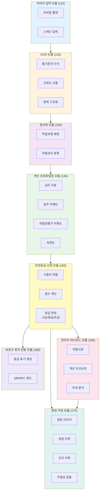

# 도 1. 시스템 블록도 (실무용 시각화 가이드)

## 0. 문서 관리 정보
- 발명 및 개발 총괄: 박성훈
- 검토 완료일: 2026-03-02
- 시스템 적용 버전: PSI v2.1.0
- 상태: ✅ 현장 검증 및 프로덕션 배포 완료

## Mermaid 다이어그램 코드



## PPT/Visio용 배치 가이드

### 레이아웃 구조
```
┌─────────────────────────────────────────────────────────────┐
│                     [110] 이미지 입력 모듈                   │
│                  (모바일 촬영 + 스캐너 입력)                 │
└────────────────────────┬────────────────────────────────────┘
                         ↓
┌─────────────────────────────────────────────────────────────┐
│                      [120] OCR 모듈                          │
│         (필기인식 → 신뢰도산출 → 항목구조화)                │
└────────────────────────┬────────────────────────────────────┘
                         ↓
┌─────────────────────────────────────────────────────────────┐
│                    [130] 정규화 모듈                         │
│           (작업유형 매핑 + 위험요인 분류)                    │
└────────────────────────┬────────────────────────────────────┘
                         ↓
┌─────────────────────────────────────────────────────────────┐
│                 [140] 개인 프로파일링 모듈                   │
│   (심리지표·업무이해도·위험성평가이해도·숙련도)             │
└────────────────────────┬────────────────────────────────────┘
                         ↓
┌─────────────────────────────────────────────────────────────┐
│                 [150] 안전등급 산정 모듈                     │
│      (가중치적용 → 점수계산 → 등급판정:고급/중급/초급)      │
└────────┬───────────────┬────────────────┬───────────────────┘
         ↓               ↓                ↓
    ┌────────┐    ┌────────────┐   ┌──────────────┐
    │ [160]  │    │   [170]    │   │    [180]     │
    │ 관리자 │    │   증빙     │   │   보호구     │
    │대시보드│    │ 저장 모듈  │   │표지연동모듈  │
    └────────┘    └────────────┘   └──────────────┘
```

## 도면부호 범례
- **100**: 전체 시스템
- **110**: 이미지 입력 모듈
- **120**: OCR 모듈
- **130**: 정규화 모듈
- **140**: 개인 프로파일링 모듈
- **150**: 안전등급 산정 모듈
- **160**: 관리자 대시보드 모듈
- **170**: 증빙 저장 모듈
- **180**: 보호구 표지 연동 모듈

## 색상 가이드 (출원 흑백본 대비용)
- 입력/출력 블록: 연한 청색
- 처리 블록: 연한 황색
- 저장 블록: 연한 녹색
- 연동 블록: 연한 자주색
