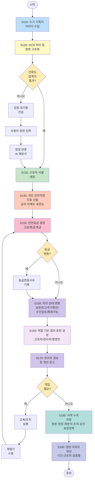

# 도 2. 방법 흐름도 (실무용 시각화 가이드)

## 0. 문서 관리 정보
- 발명 및 개발 총괄: 박성훈
- 검토 완료일: 2026-04-09
- 시스템 적용 버전: PSI v2.2.0
- 상태: ✅ 브랜드·권리화 보정 반영 완료
- 최종본 잠금 태그: PSI-v2.2.0-2026-04-09-AMENDED

## Mermaid 다이어그램 코드



## PPT/Visio용 세로형 플로우차트

```
     ┌────────────────┐
     │     시작       │
     └───────┬────────┘
             ↓
     ┌───────────────────────┐
     │ S110: 기록지 이미지   │
     │       수집            │
     └───────┬───────────────┘
             ↓
     ┌───────────────────────┐
     │ S120: OCR 처리 및     │
     │       항목 구조화     │
     └───────┬───────────────┘
             ↓
        ◇───────────◇
       /  신뢰도     \
        < 임계치 통과?  >──NO──→ [검증대기열] → [사용자 정정]
                                                                     ↓
                                                             [AI 재분석]
       \            /                         ↓
        ◇─────────◇                          │
             │ YES                            │
             ↓←──────────────────────────────┘
     ┌───────────────────────┐
     │ S130: 근로자 식별     │
     │       매칭            │
     └───────┬───────────────┘
             ↓
     ┌───────────────────────┐
     │ S140: 개인 안전역량   │
     │  지표 산출            │
     │ (심리·이해도·숙련도)  │
     └───────┬───────────────┘
             ↓
     ┌───────────────────────┐
     │ S150: 안전등급 결정   │
     │ (고급/중급/초급)      │
     └───────┬───────────────┘
             ↓
        ◇───────────◇
       /  등급       \
      <   변동?       >──YES──→ [등급변동사유 기록]
       \            /                    ↓
        ◇─────────◇                     │
             │ NO                        │
             ↓←───────────────────────────┘
     ┌───────────────────────┐
     │ S158: 의미 상태 변환  │
     │ (보완권고/추가확인/   │
     │  우선검토/확정가능)   │
     └───────┬───────────────┘
             ↓
     ┌───────────────────────┐
     │ S160: 역할 기반 결과  │
     │       표현 생성       │
     │(근로자/관리자/경영진) │
     └───────┬───────────────┘
             ↓
     ┌───────────────────────┐
     │ S170: 관리자 경보     │
     │       개선 권고       │
     └───────┬───────────────┘
             ↓
        ◇───────────◇
       /  개입       \
      <   필요?       >──YES──→ [교육/조치] → [재평가]
       \            /                           ↓
        ◇─────────◇                           │
             │ NO                               │
             ↓                                  │
             └←─────────────────────────────────┘
                                        (S150으로 피드백)
             ↓
     ┌───────────────────────┐
        │ S180: 이력 누적 저장  │
        │ (원본·정정·재분석·    │
        │  조치·승인·표현정책)  │
     └───────┬───────────────┘
             ↓
     ┌───────────────────────┐
     │ S190: 증빙 리포트     │
     │       생성            │
     └───────┬───────────────┘
             ↓
     ┌────────────────┐
     │     종료       │
     └────────────────┘
```

## 단계별 설명 (명세서 대응)

| 단계 | 명칭 | 입력 | 출력 | 비고 |
|------|------|------|------|------|
| S110 | 이미지 수집 | 수기 문서 | 이미지 파일 | 모바일/스캐너 |
| S120 | OCR 구조화 | 이미지 | 텍스트+신뢰도 | 항목별 점수 산출 |
| S125 | 신뢰도 판정 | OCR 결과 | 통과/보정 분기 | 임계치 비교 |
| S126 | 검증 대기열 전송 | 저신뢰 항목 | 검수 대상 | 자동 분류 |
| S127 | 사용자 정정 입력 | 검수 대상 | 정정 데이터 | 전/후값 기록 |
| S128 | AI 재분석 | 정정 데이터 | 재분석 결과 | 정정 반영 처리 |
| S130 | 근로자 매칭 | 텍스트 | 근로자ID | 사번/QR/서명 |
| S140 | 역량 산출 | 구조화 데이터 | 안전역량점수 | P = Σw·지표 |
| S150 | 등급 결정 | 역량점수 | 고급/중급/초급 | 임계치 기반 |
| S158 | 의미 상태 변환 | 등급/근거 | 의미 상태 | 코칭/검토용 상태화 |
| S160 | 역할별 표현 생성 | 의미 상태 | 역할별 결과 | 근로자/관리자/경영진 |
| S170 | 경보 권고 | 역할별 결과 | 개입 대상 목록 | 관리자 화면 |
| S180 | 이력 저장 | 전 단계 데이터 | 증빙 패키지 | 시계열 누적 |
| S190 | 리포트 생성 | 증빙 패키지 | PDF/CSV | 법규 대응용 |

## 주요 분기점
- **신뢰도 검증**: 임계치(예: 70%) 미만 시 검증 대기열
- **정정 재분석**: 사용자 정정 입력 시 정정 반영 AI 재분석 단계 수행
- **등급 변동**: 이전 등급과 다를 경우 변동 사유 기록
- **의미 상태 변환**: 동일 분석 결과를 보완 권고·추가 확인·우선 검토 등 의미 상태로 치환
- **개입 필요**: 초급 등급 또는 반복 위반 시 재교육 루프 진입
