# 도 3. 안전등급 산정 상세도 (실무용 시각화 가이드)

## 0. 문서 관리 정보
- 발명 및 개발 총괄: 박성훈
- 검토 완료일: 2026-03-02
- 시스템 적용 버전: PSI v2.1.0
- 상태: ✅ 현장 검증 및 프로덕션 배포 완료

## Mermaid 다이어그램 코드

```mermaid
flowchart LR
    subgraph COLLECT["지표 수집부 (210)"]
        A1[심리 지표<br/>0~100점]
        A2[업무 이해도<br/>0~100점]
        A3[위험성평가<br/>이해도<br/>0~100점]
        A4[숙련도<br/>0~100점]
        A5[개선이행도<br/>0~100점]
        A6[반복위반도<br/>페널티<br/>0~20점]
    end
    
    subgraph WEIGHT["가중치 적용부 (220)"]
        B1[현장·공종별<br/>가중치 설정]
        B2[w1~w6<br/>가중치 벡터]
    end
    
    subgraph CALC["점수 계산부 (230)"]
        C1[P = Σ w·지표<br/>- 페널티]
        C2[최종 점수<br/>0~100점]
    end
    
    subgraph JUDGE["등급 판정부 (240)"]
        D1{P ≥ 75?}
        D2{P ≥ 50?}
        D3[고급<br/>우수]
        D4[중급<br/>보통]
        D5[초급<br/>관리필요]
    end
    
    subgraph REASON["변동 사유 기록부 (250)"]
        E1[이전 등급]
        E2[새 등급]
        E3[변동 사유<br/>코드]
        E4[변동 일시]
    end
    
    subgraph TRIGGER["표지 갱신 트리거부 (260)"]
        F1[보호구 표지<br/>연동 모듈<br/>호출]
    end
    
    COLLECT --> WEIGHT
    WEIGHT --> CALC
    CALC --> JUDGE
    
    D1 -->|예| D3
    D1 -->|아니오| D2
    D2 -->|예| D4
    D2 -->|아니오| D5
    
    D3 --> REASON
    D4 --> REASON
    D5 --> REASON
    
    REASON --> TRIGGER
    
    style COLLECT fill:#e8f5e9
    style WEIGHT fill:#fff9c4
    style CALC fill:#ffccbc
    style JUDGE fill:#f8bbd0
    style REASON fill:#b2dfdb
    style TRIGGER fill:#c5cae9
```



## 산정 로직 상세 (실시예)

### 1단계: 지표 수집 (210)

| 지표 | 산정 방식 | 범위 |
|------|-----------|------|
| 심리 지표 | OCR 필기품질 + 답변완성도 + 스트레스수준 분석 | 0~100 |
| 업무 이해도 | 작업종류·위험요인 식별 정확도 | 0~100 |
| 위험성평가 이해도 | 예방대책 적절성·구체성 평가 | 0~100 |
| 숙련도 | 근무기간 + 교육이수 + 과거평가이력 | 0~100 |
| 개선이행도 | 지적사항 조치완료율 | 0~100 |
| 반복위반도 | 동일항목 재발 빈도 (페널티) | 0~20 |

### 2단계: 가중치 적용 (220)

**기본 가중치 예시** (현장 특성에 따라 조정 가능)
```
w1 (심리) = 0.15
w2 (업무이해) = 0.25
w3 (위험성평가이해) = 0.30
w4 (숙련도) = 0.20
w5 (개선이행) = 0.10
w6 (반복위반 페널티) = 1.0
```

### 3단계: 점수 계산 (230)

```
P = (w1×심리) + (w2×업무이해) + (w3×위험성평가이해) 
    + (w4×숙련도) + (w5×개선이행) - (w6×반복위반)
```

**계산 예시**
- 심리: 75점, 업무이해: 80점, 위험성평가이해: 70점
- 숙련도: 85점, 개선이행: 90점, 반복위반: 5점
```
P = 0.15×75 + 0.25×80 + 0.30×70 + 0.20×85 + 0.10×90 - 1.0×5
  = 11.25 + 20 + 21 + 17 + 9 - 5
  = 73.25점
```

### 4단계: 등급 판정 (240)

```
if P ≥ 75:
    등급 = "고급 (우수)"
elif P ≥ 50:
    등급 = "중급 (보통)"
else:
    등급 = "초급 (관리필요)"
```

## PPT/Visio용 블록 배치

```
┌─────────────────────────────────────────────────┐
│         [210] 지표 수집부                       │
│  ┌────┐ ┌────┐ ┌────┐ ┌────┐ ┌────┐ ┌────┐   │
│  │심리│ │업무│ │위험│ │숙련│ │개선│ │반복│   │
│  │지표│ │이해│ │평가│ │도 │ │이행│ │위반│   │
│  └────┘ └────┘ └────┘ └────┘ └────┘ └────┘   │
└────────────────┬────────────────────────────────┘
                 ↓
         ┌───────────────┐
         │ [220] 가중치  │
         │    적용부     │
         │  w1~w6 설정   │
         └───────┬───────┘
                 ↓
         ┌───────────────┐
         │ [230] 점수    │
         │   계산부      │
         │  P = Σw·지표  │
         └───────┬───────┘
                 ↓
         ┌───────────────┐
         │ [240] 등급    │
         │   판정부      │
         │ ◇ P≥75? →고급 │
         │ ◇ P≥50? →중급 │
         │   → 초급      │
         └───────┬───────┘
                 ↓
    ┌────────────────────────┐
    │ [250] 변동사유 기록부  │
    │ 이전·새등급·사유·일시 │
    └────────────┬───────────┘
                 ↓
    ┌────────────────────────┐
    │ [260] 표지갱신트리거부 │
    │  보호구 표지 연동      │
    └────────────────────────┘
```

## 변동 사유 코드 예시

| 코드 | 사유 |
|------|------|
| U01 | 재교육 이수로 인한 상향 |
| U02 | 개선조치 이행 완료로 인한 상향 |
| D01 | 반복 위반 누적으로 인한 하향 |
| D02 | 신규 위험항목 발견으로 인한 하향 |
| K00 | 등급 유지 (정기 재평가) |
